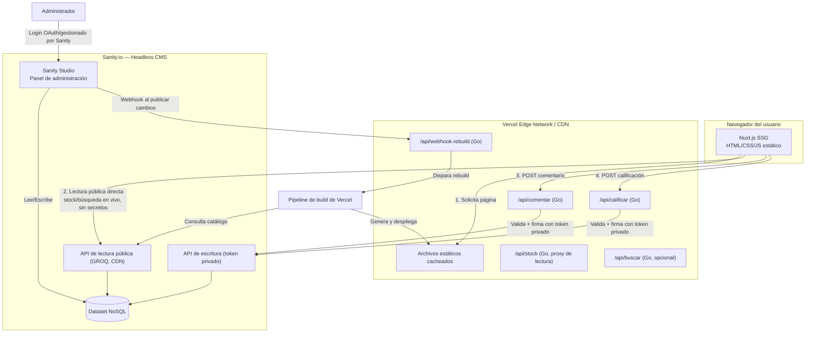

# Arquitectura Técnica Detallada — Plataforma Web "LectorPobre"

**Patrón arquitectónico:** Jamstack desacoplado (JavaScript, APIs, Markup) con backend "sin servidor" (serverless)
**Versión:** 2.0 — Documento ampliado a partir de los requisitos, el stack tecnológico y la arquitectura simplificada del proyecto.

---

## Tabla de contenido

1. [Resumen ejecutivo](#1-resumen-ejecutivo)
2. [Visión general del patrón arquitectónico](#2-visión-general-del-patrón-arquitectónico)
3. [Diagrama de arquitectura](#3-diagrama-de-arquitectura)
4. [Componentes del sistema](#4-componentes-del-sistema)
5. [Trazabilidad de requisitos → componentes](#5-trazabilidad-de-requisitos--componentes)
6. [Flujos de datos detallados](#6-flujos-de-datos-detallados)
7. [Diseño de la API serverless](#7-diseño-de-la-api-serverless)
8. [Modelo de seguridad y gestión de secretos](#8-modelo-de-seguridad-y-gestión-de-secretos)
9. [Consideraciones de seguridad propias de arquitecturas serverless](#9-consideraciones-de-seguridad-propias-de-arquitecturas-serverless)
10. [Consideraciones de seguridad generales](#10-consideraciones-de-seguridad-generales)
11. [Checklist de seguridad previo a producción](#11-checklist-de-seguridad-previo-a-producción)
12. [Observabilidad y monitoreo](#12-observabilidad-y-monitoreo)
13. [Escalabilidad, costos y disponibilidad](#13-escalabilidad-costos-y-disponibilidad)
14. [Glosario](#14-glosario)

---

## 1. Resumen ejecutivo

LectorPobre es una plataforma de catálogo de productos que prioriza **rendimiento, SEO y costo operativo mínimo**. Para lograrlo, la arquitectura desacopla completamente tres responsabilidades:

- **Presentación**: un sitio estático pre-renderizado (Nuxt.js/SSG) servido desde una CDN global.
- **Lógica dinámica**: microservicios serverless en Go, activados únicamente para operaciones puntuales (calificaciones, comentarios, consulta de stock en vivo).
- **Datos y administración**: un Headless CMS (Sanity.io) que actúa como única fuente de verdad y como panel de administración sin código.

Esta separación reduce drásticamente la superficie de ataque tradicional (no hay servidor persistente, no hay base de datos expuesta directamente al cliente), pero introduce **riesgos específicos del modelo serverless y Jamstack** que se documentan a detalle en las secciones 9 y 10, atendiendo directamente el requisito **RNF-04**.

---

## 2. Visión general del patrón arquitectónico

A diferencia de un patrón MVC tradicional (donde un servidor construye cada vista en tiempo real), LectorPobre implementa **Jamstack**:

- El **contenido público** (catálogo, categorías, detalle de producto) se compila una única vez en tiempo de despliegue ("build time") en archivos HTML/CSS/JS estáticos.
- Las **operaciones dinámicas** (escritura de datos, lectura de stock en tiempo real) se delegan a funciones serverless que se ejecutan bajo demanda, viven milisegundos y desaparecen.
- No existe un servidor de aplicación "siempre encendido": esto elimina clases enteras de vulnerabilidades (parcheo de SO, gestión de sesiones en memoria, ataques de fuerza bruta contra un único punto de entrada persistente), pero exige tratar **cada invocación de función como un evento aislado y no confiable por defecto**.

Este documento asume, además, que el stack se despliega en una única cuenta de **Vercel**, que unifica el hosting del frontend estático y las funciones serverless de Go bajo un mismo repositorio.

---

## 3. Diagrama de arquitectura

> El diagrama refleja tres planos de confianza distintos: **público sin secretos** (frontend + lectura GROQ pública), **dinámico semi-confiable** (funciones Go, validan todo lo que reciben) y **administrativo autenticado** (Sanity Studio, gestionado por el proveedor del CMS).

---

## 4. Componentes del sistema

### 4.1 Capa de presentación (Frontend)

| Elemento | Detalle |
|---|---|
| Framework | Nuxt.js en modo **SSG** (Static Site Generation) |
| Librería base | Vue.js (componentes reactivos) |
| Estilos | Tailwind CSS (utility-first, tema de marca configurable) |
| Responsabilidades | Renderizar catálogo, ficha de producto, búsqueda, metadatos dinámicos (Open Graph/Twitter Cards), enlaces a redes sociales y WhatsApp |
| Datos que consume | (a) Contenido estático inyectado en build time; (b) lecturas en vivo vía API pública GROQ para datos volátiles como stock (ver 6.3); (c) escrituras vía funciones Go |
| Principio clave | El frontend **no almacena ni conoce ningún secreto**: todas las peticiones salientes usan endpoints públicos de solo lectura o los proxies de Go para escritura. |

### 4.2 Capa de lógica de negocio (Backend Serverless en Go)

| Elemento | Detalle |
|---|---|
| Lenguaje | Go (Golang) — tipado estricto, sin tiempos de arranque perceptibles |
| Modelo de ejecución | Funciones independientes ("Function as a Service"), sin estado entre invocaciones, escaladas automáticamente por Vercel |
| Responsabilidades | Actuar como **proxy de confianza** entre el navegador y Sanity: validar entrada, aplicar controles anti-bot/anti-spam, firmar peticiones con el token privado y escribir en el CMS |
| Principio clave | Cada función asume que **todo el payload recibido es hostil hasta que se demuestre lo contrario** (ver sección 9). |

### 4.3 Capa de datos y gestión de contenido (Headless CMS)

| Elemento | Detalle |
|---|---|
| Plataforma | Sanity.io (NoSQL orientado a documentos, alojado en la nube del proveedor) |
| Panel administrativo | Sanity Studio (interfaz visual autogenerada, sin código, con autenticación gestionada por Sanity) |
| Modelo de acceso | Dos niveles de token: **token de lectura pública** (CDN API, sin secretos, para catálogo y stock) y **token de escritura privado** (con permisos acotados por tipo de documento, usado exclusivamente por las funciones Go) |
| Responsabilidades | Fuente única de verdad para productos, categorías, imágenes, stock, comentarios/calificaciones y configuración visual del sitio (paleta de colores, elementos gráficos) |

### 4.4 Infraestructura y despliegue (Vercel)

| Elemento | Detalle |
|---|---|
| Plataforma unificada | Vercel aloja el sitio estático (CDN global) y las funciones Go bajo un mismo repositorio/pipeline |
| CI/CD | Cada push a la rama principal o cada webhook de Sanity dispara un nuevo build de Nuxt.js |
| Variables de entorno | Segregadas por ambiente (Production / Preview / Development), almacenan el token privado de escritura de Sanity y claves de servicios anti-bot/analítica |
| Costos | Modelo "pay-per-use"; sin servidores encendidos permanentemente |

---

## 5. Trazabilidad de requisitos → componentes

| Requisito | Descripción resumida | Componente responsable |
|---|---|---|
| RF-01, RF-02, RF-04 | Catálogo, detalle y categorías | Frontend (Nuxt SSG) + datos pre-compilados de Sanity |
| RF-03, RNF-03 | Stock en tiempo real | Frontend → API de lectura pública de Sanity (llamada en vivo, sin pasar por build) |
| RF-05, RF-17 | Enlaces a redes sociales y WhatsApp | Frontend (enlaces estáticos configurables desde Sanity) |
| RF-06 | Calificación por estrellas | Frontend → `POST /api/calificar` (Go) → Sanity (escritura) |
| RF-07 | Comentarios de texto | Frontend → `POST /api/comentar` (Go) → Sanity (escritura, con moderación) |
| RF-08, RF-09, RF-10 | Login/logout/panel admin | Sanity Studio (autenticación gestionada por el proveedor del CMS) |
| RF-11 a RF-16 | Edición de catálogo, imágenes, stock, paleta y elementos visuales | Sanity Studio (sin código) — los cambios disparan rebuild vía webhook |
| RF-18 | Búsqueda por palabra clave | Índice generado en build time (cliente) o función `GET /api/buscar` (Go) si se requiere búsqueda sobre datos no incluidos en el build |
| RF-19 | Paginación / carga diferida | Frontend (Nuxt), sobre datos ya compilados o paginados vía API pública |
| RF-20 | Metadatos dinámicos (SEO/OG) | Generados en build time por Nuxt a partir del contenido de Sanity |
| RNF-01 | Navegación sin autenticación | Arquitectura Jamstack por diseño (contenido público estático) |
| RNF-02 | Animaciones sin impacto en rendimiento | Frontend (SSG + assets optimizados en CDN) |
| RNF-04 | Seguridad del backend sin estado | Funciones Go (ver secciones 8 y 9) |
| RNF-05 | Responsividad móvil | Frontend (Tailwind CSS) |
| RNF-06 | Analítica externa | Script de terceros cargado desde el frontend (ver 10.9 sobre riesgos de scripts de terceros) |

---

## 6. Flujos de datos detallados

### 6.1 Flujo de construcción (Build Time)

1. El administrador modifica un documento en Sanity Studio (producto, stock, paleta, etc.).
2. Sanity dispara un **webhook firmado** hacia una función de Vercel.
3. La función valida la firma del webhook y encola/dispara el build de Nuxt.js.
4. Nuxt consulta el catálogo vía GROQ, descarga imágenes y compila HTML/CSS/JS estáticos.
5. Vercel despliega los artefactos a su red de distribución global (CDN), invalidando la caché anterior.

### 6.2 Flujo de navegación del usuario (Client Time)

1. El usuario visita `lectorpobre.com`.
2. El nodo CDN más cercano entrega el HTML pre-renderizado sin ejecutar backend ni consultar bases de datos.
3. Resultado: rendimiento óptimo, SEO óptimo y superficie de ataque mínima para la navegación de solo lectura.

### 6.3 Flujo de consulta de stock en tiempo real (RNF-03)

Dado que el catálogo se pre-renderiza, el stock (dato volátil) requiere una fuente viva:

1. Al cargar la ficha de producto, el navegador ejecuta una consulta GROQ **directamente contra la API pública de lectura de Sanity** (CDN API), usando únicamente el `projectId`/`dataset` públicos — sin token secreto.
2. Sanity responde con el stock actual sin pasar por el build estático ni por las funciones Go.
3. Esta llamada es de solo lectura y de bajo privilegio: aunque es pública, **no debe exponer campos sensibles** del documento (ver 10.2 sobre exposición de datos por sobre-fetching).

### 6.4 Flujo de interacción dinámica — escritura (RF-06, RF-07)

1. El cliente envía un comentario o calificación desde el navegador.
2. El frontend hace `POST` a la función serverless correspondiente (`/api/comentar`, `/api/calificar`).
3. La función Go: valida esquema y tipos de datos, aplica límites de longitud/formato, ejecuta verificación anti-bot (p. ej. CAPTCHA o prueba de desafío), y aplica *rate limiting* por IP/sesión.
4. Si todo es válido, Go firma la petición con el **token privado de escritura** (con permisos acotados) y escribe el documento en Sanity, preferentemente en estado de **borrador/pendiente de moderación**.
5. La función retorna un resultado mínimo (éxito/error) y finaliza su ejecución (no persiste estado).

### 6.5 Flujo de administración (Sanity Studio)

1. El administrador se autentica contra el proveedor de identidad configurado en Sanity (OAuth o email/contraseña gestionado por Sanity).
2. Una vez autenticado, opera el panel (RF-11 a RF-16) directamente sobre el dataset.
3. Los cambios publicados disparan el flujo 6.1 para reflejarse en el sitio público.

---

## 7. Diseño de la API serverless

| Endpoint | Método | Propósito | Autenticación/Control |
|---|---|---|---|
| `/api/comentar` | POST | Publicar comentario (RF-07) | Anti-bot + rate limiting + validación de esquema |
| `/api/calificar` | POST | Registrar calificación (RF-06) | Anti-bot + rate limiting + validación de rango (1-5) |
| `/api/buscar` | GET | Búsqueda por palabra clave (RF-18), si no se resuelve 100% en cliente | Rate limiting + sanitización de parámetros de consulta |
| `/api/webhook-rebuild` | POST | Disparado por Sanity al publicar cambios | Verificación de firma HMAC del webhook |

**Contrato de error recomendado:** respuestas de error genéricas y consistentes (p. ej. `{"error":"solicitud inválida"}`) sin exponer trazas internas, nombres de campos de base de datos ni versiones de librerías (ver 9.9).

---

## 8. Modelo de seguridad y gestión de secretos

- El frontend estático **no contiene secretos**: es inmune por diseño a fugas de credenciales y a inyecciones que dependan de acceso a base de datos desde el cliente.
- El **token privado de escritura** de Sanity se almacena cifrado como variable de entorno en Vercel y es accesible **únicamente** en tiempo de ejecución de las funciones Go — nunca se expone al bundle de JavaScript del cliente ni se registra en logs.
- El **token de lectura** utilizado por el navegador para stock/catálogo debe ser el de menor privilegio posible (idealmente el modo "público" de Sanity, sin token, restringido solo a los tipos de documento necesarios).
- Principio de **mínimo privilegio**: el token de escritura solo debe poder crear/actualizar documentos de tipo `comentario`/`calificación`, nunca modificar productos, precios o configuración del sitio.
- Los secretos deben **rotarse periódicamente** y de inmediato ante cualquier sospecha de compromiso (por ejemplo, tras la salida de un colaborador con acceso al repositorio o al panel de Vercel).

---

## 9. Consideraciones de seguridad propias de arquitecturas serverless

Estas son vulnerabilidades que **no existen o son distintas** en un backend monolítico tradicional, y que deben mitigarse explícitamente para cumplir RNF-04.

### 9.1 Inyección de datos vía el evento de invocación
Cada función Go recibe el payload HTTP como un evento que **debe tratarse como no confiable**, incluso si proviene "aparentemente" del propio frontend. Mitigación: validación estricta de esquema (tipos, longitudes, formatos) en cada función, usando una librería de validación explícita en Go, nunca confiando en validaciones que solo existan en el cliente.

### 9.2 Autenticación y autorización rotas por la ausencia de estado
Al no existir sesiones de servidor persistentes, es fácil asumir erróneamente que "no hay nada que proteger". Mitigación: cualquier operación sensible debe verificarse con un mecanismo explícito por petición (tokens firmados de corta duración, verificación de origen, verificación anti-bot), nunca asumir confianza implícita solo porque la petición llegó desde el dominio esperado.

### 9.3 Permisos excesivos en la función ("over-privileged function")
Si el token de escritura usado por Go tuviera permisos de administrador completos sobre el dataset, un fallo de validación en la función comprometería todo el catálogo. Mitigación: tokens de Sanity acotados por tipo de documento (ver sección 8), y una función = un propósito, evitando funciones "todo en uno" con permisos amplios.

### 9.4 Configuración insegura del despliegue serverless
Errores comunes: variables de entorno de producción reutilizadas en despliegues *preview* públicamente accesibles, mensajes de error verbosos habilitados en producción, CORS configurado con `*` en lugar del dominio específico. Mitigación: separar variables por ambiente, deshabilitar *debug mode* en producción, y restringir CORS de las funciones a `https://lectorpobre.com` únicamente.

### 9.5 Denegación de servicio económica ("denial of wallet")
Al ser un modelo de pago por invocación, una inundación de peticiones (bots, scraping agresivo o ataques deliberados) puede traducirse en **costos económicos**, no solo en indisponibilidad. Mitigación: *rate limiting* por IP/huella digital en cada endpoint dinámico, límites de tamaño de payload, alertas de presupuesto en Vercel, y protección a nivel de Edge/WAF cuando esté disponible.

### 9.6 Persistencia de datos entre ejecuciones ("warm containers")
Las plataformas serverless reutilizan instancias "calientes" entre invocaciones por eficiencia. Si una función almacena datos en variables globales o caché en memoria, podría filtrar información de una petición hacia otra distinta. Mitigación: no mantener estado mutable global en las funciones Go; tratar cada invocación como completamente aislada.

### 9.7 Monitoreo y logging insuficientes
La naturaleza efímera de las funciones dificulta el debugging y la detección de abuso si no se centraliza el logging. Mitigación: enviar logs estructurados de cada función a una herramienta centralizada, con alertas ante tasas anómalas de error o de invocación (ver sección 12).

### 9.8 Dependencias de terceros vulnerables (cadena de suministro)
Tanto los módulos de Go como los paquetes npm del frontend son vectores de ataque conocidos (ataques a la cadena de suministro). Mitigación: análisis automatizado de dependencias (SCA), fijar versiones (*lockfiles*), y actualizar regularmente ante CVEs reportados.

### 9.9 Manejo inadecuado de excepciones
Una función que retorna trazas de pila, nombres de variables internas o detalles de la consulta GROQ facilita el reconocimiento del sistema a un atacante. Mitigación: capturar todas las excepciones en Go y devolver siempre mensajes de error genéricos al cliente, registrando el detalle real solo en el sistema de logging interno.

### 9.10 Riesgo de webhook falsificado
Si el endpoint que dispara el rebuild (`/api/webhook-rebuild`) no valida el origen, un atacante podría forzar builds repetidos (agotando minutos de build o generando costos) o intentar interferir con el pipeline. Mitigación: verificar la firma HMAC/secreto compartido que Sanity incluye en cada webhook antes de procesar la solicitud.

### 9.11 Inyección en consultas GROQ
Al construir consultas GROQ dinámicamente a partir de entrada del usuario (por ejemplo, en `/api/buscar`), concatenar cadenas sin sanitizar puede permitir alterar la consulta original. Mitigación: usar siempre parámetros tipados de la librería cliente de Sanity (`params`), nunca interpolación de strings directa con el valor ingresado por el usuario.

---

## 10. Consideraciones de seguridad generales

Además de los riesgos específicos del modelo serverless, aplican los controles estándar de seguridad web:

### 10.1 Cross-Site Scripting (XSS) en contenido generado por usuarios
Los comentarios (RF-07) son el principal vector de XSS almacenado. Mitigación: sanitizar/escapar cualquier texto ingresado por el usuario tanto al guardarlo como al renderizarlo (Vue escapa por defecto el *interpolation*, pero debe evitarse el uso de `v-html` sobre contenido no confiable), y aplicar moderación previa a la publicación pública.

### 10.2 Exposición de datos por sobre-consulta ("over-fetching")
Las consultas GROQ públicas (stock, catálogo) deben proyectar **únicamente los campos necesarios**, evitando exponer metadatos internos, notas administrativas o campos de auditoría del documento.

### 10.3 Cabeceras de seguridad HTTP
Configurar en Vercel/Nuxt: `Content-Security-Policy` (restringiendo orígenes de scripts, especialmente el de analítica), `X-Content-Type-Options: nosniff`, `X-Frame-Options`/`frame-ancestors`, `Referrer-Policy` y `Strict-Transport-Security` (HSTS) para forzar HTTPS.

### 10.4 CORS estrictamente acotado
Las funciones Go deben responder únicamente a peticiones cuyo origen sea `https://lectorpobre.com`, evitando que sitios de terceros invoquen los endpoints de escritura desde el navegador de una víctima.

### 10.5 Validación de entrada en profundidad (defensa en capas)
La validación debe existir tanto en el frontend (experiencia de usuario) como, de forma obligatoria e independiente, en cada función Go (seguridad real), asumiendo que la validación del cliente puede ser evadida.

### 10.6 Protección anti-bot y anti-spam
Los endpoints de comentarios y calificaciones deben incorporar un mecanismo de verificación humana (CAPTCHA/desafío) y *rate limiting*, tal como ya contempla la arquitectura simplificada, para evitar spam masivo y manipulación de calificaciones.

### 10.7 Gestión segura de imágenes (RF-12)
Validar tipo MIME real (no solo la extensión), tamaño máximo y, de ser posible, reprocesar/recomprimir las imágenes subidas para eliminar metadatos y neutralizar archivos maliciosamente disfrazados de imagen.

### 10.8 Seguridad del pipeline de CI/CD
Proteger la rama principal del repositorio (revisión obligatoria antes de fusionar), habilitar *secret scanning* para evitar que tokens se suban accidentalmente al control de versiones, y usar la protección de despliegues *preview* de Vercel para que no queden URLs de prueba públicamente indexables con datos reales.

### 10.9 Riesgos de scripts de terceros (RNF-06 — analítica)
Cualquier script externo cargado en el sitio (analítica) es, en la práctica, código con capacidad de ejecutarse en el contexto del usuario. Mitigación: cargarlo de forma asíncrona/diferida, aplicar `Subresource Integrity (SRI)` cuando el proveedor lo permita, y restringir su alcance mediante la CSP definida en 10.3.

### 10.10 Privacidad y cumplimiento normativo
El servicio de analítica (RNF-06) debe configurarse para minimizar la recolección de datos personales, informar su uso (aviso de privacidad/cookies según la jurisdicción aplicable) y evitar el registro de información sensible en logs o en los propios comentarios públicos.

### 10.11 Gestión del ciclo de vida de secretos
Además de Sanity, cualquier clave de servicios de analítica o anti-bot debe tratarse como secreto: nunca *hardcodeada* en el repositorio, siempre vía variables de entorno, y con acceso restringido a quienes realmente la necesiten.

---

## 11. Checklist de seguridad previo a producción

- [ ] Tokens de Sanity segregados (lectura pública vs. escritura privada acotada por tipo de documento)
- [ ] CORS de funciones Go restringido al dominio de producción
- [ ] Rate limiting activo en `/api/comentar`, `/api/calificar` y `/api/buscar`
- [ ] Verificación de firma en `/api/webhook-rebuild`
- [ ] CSP y cabeceras de seguridad configuradas en Nuxt/Vercel
- [ ] Sanitización de salida para comentarios (prevención de XSS almacenado)
- [ ] Moderación/estado de borrador para comentarios y calificaciones antes de publicación
- [ ] Mensajes de error genéricos en producción (sin trazas de pila)
- [ ] Análisis de dependencias (Go modules y npm) sin CVEs críticos abiertos
- [ ] Variables de entorno separadas por ambiente (Production/Preview/Development)
- [ ] Protección de despliegues *preview* de Vercel
- [ ] *Secret scanning* habilitado en el repositorio
- [ ] Validación de imágenes (tipo MIME real y tamaño) en subida desde Sanity Studio
- [ ] Consultas GROQ parametrizadas (sin concatenación de entrada de usuario)
- [ ] Alertas de presupuesto/uso configuradas en Vercel para detectar abuso de funciones

---

## 12. Observabilidad y monitoreo

- Centralizar logs estructurados de las funciones Go (nivel, timestamp, endpoint, resultado) sin registrar datos sensibles ni el contenido íntegro de secretos.
- Definir alertas ante: tasa de error anómala, picos de invocación por IP, fallas repetidas de verificación anti-bot y fallos de validación de firma de webhook.
- Revisar periódicamente el panel de analítica de Vercel (invocaciones, latencia, errores) como parte de la operación normal, no solo ante incidentes.

---

## 13. Escalabilidad, costos y disponibilidad

- El uso de Go minimiza los tiempos de arranque en frío, por lo que la latencia percibida en operaciones dinámicas se mantiene baja incluso bajo demanda variable.
- El contenido estático servido por CDN escala de forma prácticamente ilimitada sin costo adicional relevante.
- El principal factor de costo variable son las invocaciones de funciones; por ello, el *rate limiting* (sección 9.5) cumple una doble función: seguridad **y** control de costos.
- Ante fallos en Sanity (API de lectura), el sitio estático sigue disponible con el último contenido compilado; solo se degradan las funcionalidades dinámicas (stock en vivo, comentarios, calificaciones).

---

## 14. Glosario

| Término | Definición breve |
|---|---|
| Jamstack | Patrón arquitectónico basado en JavaScript, APIs y Markup pre-generado |
| SSG | Static Site Generation: generación de páginas HTML en tiempo de build |
| Serverless | Modelo de ejecución de código bajo demanda, sin gestión directa de servidores |
| GROQ | Lenguaje de consulta de Sanity.io para su base de datos orientada a documentos |
| Headless CMS | Sistema de gestión de contenido que expone su contenido vía API, sin capa de presentación propia |
| Cold start | Tiempo de arranque de una función serverless tras estar inactiva, antes de poder procesar una petición |
| Denial of wallet | Ataque orientado a generar costos económicos excesivos explotando modelos de pago por uso |
| CSP | Content Security Policy: cabecera HTTP que restringe qué recursos puede cargar/ejecutar una página |

---

*Este documento amplía la arquitectura simplificada original añadiendo trazabilidad de requisitos, diseño de API y un análisis de seguridad específico para arquitecturas serverless y Jamstack, en cumplimiento del requisito no funcional RNF-04.*
