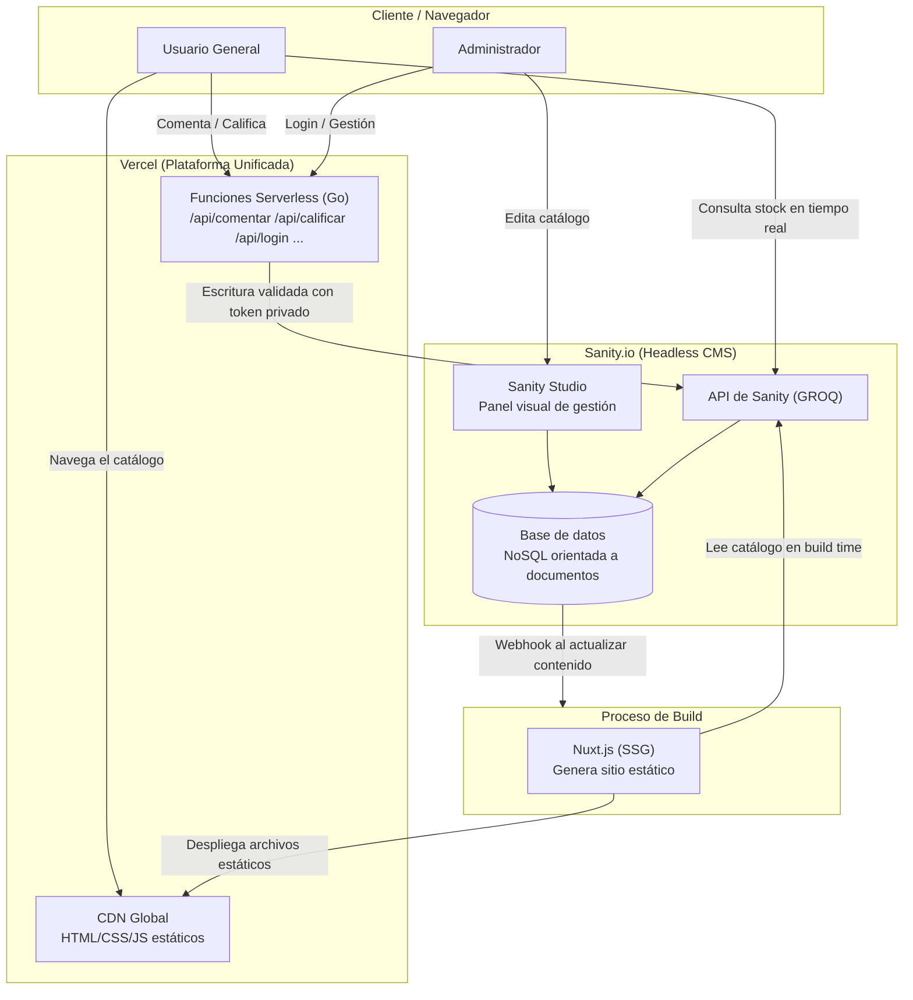
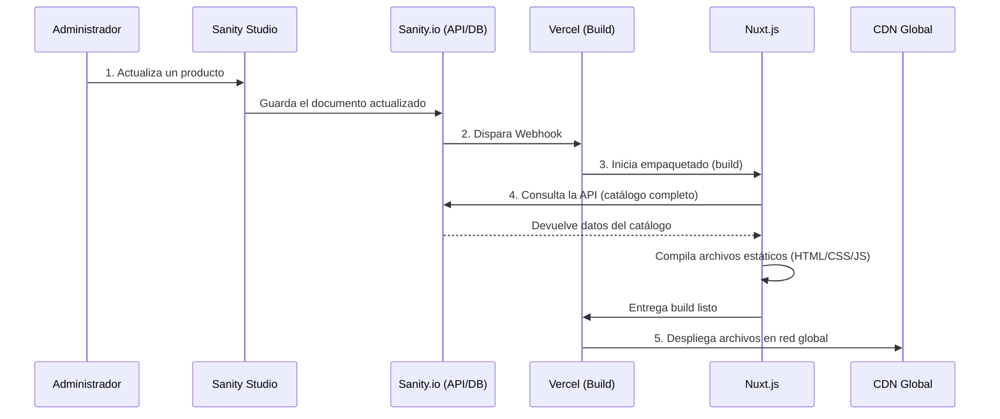
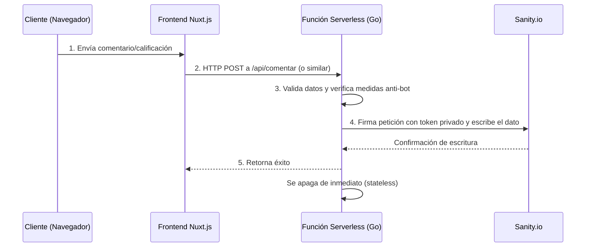

# Stack Tecnológico y Arquitectura de Despliegue
## Proyecto: Plataforma Web "LectorPobre"

**Versión:** 1.0
**Basado en:** `Stack_Tecnologico_LectorPobre.pdf`, `Arquitectura_Detallada_LectorPobre.pdf`
**Documento relacionado:** `ERS_LectorPobre.md` (Especificación de Requisitos de Software)

---

## 1. Introducción y Objetivo

Este documento describe, con el mayor nivel de detalle posible, el stack tecnológico seleccionado para LectorPobre y la justificación técnica de cada decisión, en el contexto de una **arquitectura Jamstack desacoplada**. El objetivo es servir como referencia técnica para el equipo de desarrollo y como documento de comunicación técnica hacia la parte interesada del negocio.

El patrón arquitectónico elegido es **Jamstack** (**J**avaScript, **A**PIs, **M**arkup), que se diferencia del patrón tradicional MVC en que el servidor **no** construye las páginas en tiempo real para cada visitante. En su lugar, el sitio se **pre-renderiza una sola vez** en tiempo de build, y solo se recurre a servicios dinámicos (vía APIs) cuando es estrictamente necesario (p. ej. stock en tiempo real, comentarios, calificaciones, autenticación de administrador).

---

## 2. Resumen Arquitectónico

### 2.1 Diagrama de Componentes

### 2.2 Tabla Resumen del Stack

| Capa | Tecnología | Rol principal |
|---|---|---|
| Frontend / Presentación | **Nuxt.js** (sobre **Vue.js**) | Generación de sitio estático (SSG), SEO, UI |
| Estilos | **Tailwind CSS** | Sistema de utilidades para diseño responsivo |
| Backend / Lógica de negocio | **Go (Golang)** | Funciones serverless para operaciones dinámicas |
| Base de datos y CMS | **Sanity.io** | Headless CMS NoSQL orientado a documentos |
| Panel administrativo de contenido | **Sanity Studio** | Interfaz visual autogenerada, sin código |
| Infraestructura / Hosting | **Vercel** | Despliegue unificado de frontend y funciones serverless, CDN |
| Consulta de datos | **GROQ** | Lenguaje de consulta nativo de Sanity |

---

## 3. Frontend (Interfaz de Usuario)

### 3.1 Framework Principal: Nuxt.js

- **Versión recomendada:** Nuxt 3.x (sobre Vue 3, Composition API).
- **Justificación:** se elige por su capacidad de **Generación de Sitios Estáticos (SSG)** mediante `nuxi generate`, lo que garantiza:
  - Tiempos de carga instantáneos, al servir HTML pre-construido desde una CDN en lugar de renderizar en cada petición.
  - Compatibilidad absoluta con metadatos dinámicos para SEO y para las vistas previas al compartir en redes sociales / WhatsApp (RF-20 del ERS), mediante el módulo de gestión de `<head>` de Nuxt (`useHead` / `useSeoMeta`).
  - Estructura de enrutamiento basada en archivos, ideal para páginas de producto generadas dinámicamente a partir del catálogo en Sanity (`pages/producto/[slug].vue`).
- **Responsabilidades dentro del sistema:**
  - Consumir la API de Sanity.io en tiempo de build para generar el catálogo estático (RF-01, RF-02, RF-04).
  - Renderizar metadatos Open Graph / Twitter Cards por producto (RF-20).
  - Alojar la lógica de búsqueda y filtrado client-side sobre el dataset ya cargado (RF-18).
  - Realizar, de forma controlada, las consultas dinámicas necesarias para stock en tiempo real (RF-03/RNF-03) y las llamadas a las funciones serverless para escritura (RF-06, RF-07, RF-08 a RF-10).

### 3.2 Librería Base: Vue.js

- **Versión recomendada:** Vue 3.x (Composition API), motor sobre el cual corre Nuxt.
- **Justificación:** proporciona una estructura de componentes **reactiva y ligera**, ideal para construir piezas de interfaz reutilizables (tarjeta de producto, sistema de calificación por estrellas, formulario de comentarios, panel de administración) con un rendimiento de renderizado eficiente y una curva de aprendizaje moderada.

### 3.3 Estilos: Tailwind CSS

- **Versión recomendada:** Tailwind CSS 3.x, integrado vía el módulo oficial `@nuxtjs/tailwindcss`.
- **Justificación:** framework de utilidades (*utility-first*) que permite:
  - Construir un diseño **responsivo** de forma consistente (RNF-05), usando los *breakpoints* estándar (`sm`, `md`, `lg`, `xl`) con un enfoque mobile-first.
  - Mantener el diseño **modular** y fácilmente adaptable a la paleta de colores de la marca, mediante la extensión del archivo `tailwind.config.js` (tokens de color, tipografía, espaciados).
  - Soportar el requisito de personalización de paleta de colores y elementos visuales del panel de administración (RF-15, RF-16), al poder mapear variables de diseño configurables (p. ej. `theme.extend.colors`) a valores provenientes de Sanity.
  - Minimizar el peso final del CSS gracias al *purging* automático de clases no utilizadas, alineado con el objetivo de rendimiento (RNF-02).

---

## 4. Backend (Lógica sin Estado)

### 4.1 Lenguaje Principal: Go (Golang)

- **Versión recomendada:** Go 1.22+ (o la última versión estable compatible con el runtime de Vercel).
- **Justificación:**
  - **Rendimiento excepcional**: binarios compilados con tiempos de ejecución muy bajos, ideales para funciones invocadas bajo demanda.
  - **Tipado estricto**: reduce errores en tiempo de ejecución al validar contratos de datos (p. ej. estructura de un comentario o calificación) en tiempo de compilación.
  - **Nulos tiempos de arranque (cold starts)** en entornos serverless en comparación con runtimes interpretados más pesados, lo que es crítico para mantener una experiencia de usuario fluida en operaciones dinámicas (calificar, comentar, iniciar sesión).

### 4.2 Arquitectura: Funciones Serverless

- **Modelo:** microservicios independientes (una función por endpoint), desplegados como **Vercel Functions** escritas en Go, que se ejecutan **únicamente bajo demanda** para procesar operaciones dinámicas.
- **Endpoints sugeridos** (a definir en diseño técnico detallado, en línea con el ERS):

| Endpoint (sugerido) | Método | Requisito relacionado | Descripción |
|---|---|---|---|
| `/api/auth/login` | POST | RF-08 | Autentica al administrador y emite un token/sesión |
| `/api/auth/logout` | POST | RF-09 | Invalida el token/sesión activa |
| `/api/stock/:id` | GET | RF-03, RNF-03 | Consulta el stock actual de un producto en tiempo real |
| `/api/calificar` | POST | RF-06 | Registra una calificación por estrellas, con validación anti-abuso |
| `/api/comentar` | POST | RF-07 | Registra un comentario de texto, con validación/sanitización |
| `/api/admin/productos` | POST/PUT/DELETE | RF-11, RF-12, RF-13 | Operaciones protegidas de gestión de catálogo (o delegadas a Sanity Studio) |
| `/api/webhook/rebuild` | POST | Flujo de build | Webhook interno disparado por Sanity para reconstruir el sitio |

- **Responsabilidad clave:** cada función actúa como un **proxy seguro**, validando la entrada del usuario (esquema, longitud, formato) antes de comunicarse con la base de datos, y firmando las peticiones hacia Sanity con un token privado que nunca se expone al cliente (ver Sección 7, Modelo de Seguridad).

---

## 5. Base de Datos y Gestión de Contenido

### 5.1 Plataforma (Headless CMS): Sanity.io

- **Naturaleza:** base de datos **no relacional (NoSQL)** orientada a documentos, alojada en infraestructura cloud gestionada por Sanity.
- **Rol en la arquitectura:** actúa simultáneamente como **fuente de verdad del catálogo** (productos, categorías, imágenes, configuración visual) y como **destino de las operaciones de escritura** dinámicas (comentarios, calificaciones).
- **Lenguaje de consulta:** **GROQ** (Graph-Relational Object Queries), utilizado tanto por Nuxt.js (lecturas en build time y consultas en tiempo real de stock) como por las funciones en Go (escrituras y lecturas puntuales).
- **Modelo de datos sugerido (esquemas):**
  - `producto`: nombre, descripción, imágenes, categoría (referencia), stock, calificación promedio, comentarios (referencia o array).
  - `categoria`: nombre, slug.
  - `comentario`: texto, producto (referencia), fecha, estado de moderación (si aplica).
  - `configuracionGlobal`: paleta de colores activa, variante visual activa, enlaces a redes sociales, número de WhatsApp.

### 5.2 Panel Administrativo: Sanity Studio

- **Naturaleza:** interfaz visual **autogenerada** a partir de los esquemas definidos en código, desplegable de forma independiente (p. ej. como subdominio propio o embebida).
- **Rol:** permite a los dueños del negocio **gestionar el catálogo, stock e imágenes sin requerir código** (RF-11 a RF-16), cubriendo gran parte de las necesidades del panel de administración descritas en el ERS sin desarrollo a medida adicional.
- **Consideración de diseño:** para los requisitos de autenticación específicos del negocio (RF-08, RF-09, RF-10) debe definirse si se utiliza el sistema de autenticación propio de Sanity Studio (para gestión de contenido) y/o una capa de autenticación independiente en Go para otras vistas administrativas personalizadas fuera de Sanity Studio.

---

## 6. Infraestructura y Despliegue (Hosting)

### 6.1 Plataforma Unificada: Vercel

- **Rol:** despliega automáticamente tanto el **frontend estático** generado por Nuxt como las **funciones serverless** programadas en Go, a través de un **único repositorio**, manteniendo **costos operativos nulos** en escenarios de tráfico bajo/moderado (modelo *pay-per-use* con generosa capa gratuita).
- **CDN Global:** los archivos estáticos generados por Nuxt se distribuyen automáticamente a través de la red de Vercel, entregando contenido desde el nodo más cercano al usuario (bajo tiempo de latencia, alineado con RNF-02).
- **Variables de entorno:** Vercel almacena de forma cifrada los secretos (tokens de Sanity, credenciales de administrador) accesibles únicamente por las funciones serverless en tiempo de ejecución (ver Sección 7).
- **CI/CD:** cada `push` al repositorio (o cada webhook de Sanity) puede disparar automáticamente un nuevo build y despliegue, integrando control de versiones (Git) con el flujo de publicación de contenido.

---

## 7. Flujos de Datos y Comunicación

El sistema maneja tres flujos de datos distintos según la etapa de ejecución, optimizando rendimiento y seguridad.

### 7.1 Tiempo de Construcción (Build Time)

### 7.2 Navegación del Usuario (Client Time)

1. Un cliente accede a `lectorpobre.com`.
2. Vercel entrega el archivo HTML pre-renderizado al instante desde el nodo más cercano (CDN).
3. **No hay consultas a bases de datos ni ejecución de backend** en esta fase; rendimiento y SEO óptimos (satisface RNF-02 y el objetivo de carga instantánea).

### 7.3 Interacción Dinámica (Operación de Escritura)

---

## 8. Modelo de Seguridad y Autenticación

La separación de responsabilidades propia de Jamstack **aísla los riesgos** por diseño:

- El **frontend estático** carece de conexiones a bases de datos o secretos; al servir únicamente archivos HTML/CSS/JS pre-generados, es **inmune a ataques de inyección** dirigidos a la base de datos.
- Las **llaves privadas (tokens)** de Sanity se almacenan de forma **encriptada como variables de entorno en Vercel**, accesibles única y exclusivamente por el microservicio en Go, nunca expuestas al cliente.
- Esta separación garantiza que **ningún actor malicioso pueda alterar el catálogo público o saltarse la moderación de contenido** directamente desde el navegador.

### 8.1 Riesgos específicos de la arquitectura serverless (a mitigar en diseño técnico)

| Riesgo | Descripción | Mitigación sugerida |
|---|---|---|
| Inyección GROQ | Entrada de usuario no sanitizada concatenada en una consulta GROQ | Uso de parámetros/queries preparadas, nunca interpolación directa de strings |
| DoS económico | Abuso de invocaciones a funciones serverless para incrementar costos | Rate limiting por IP/sesión, límites de Vercel, validación temprana de payloads |
| Fuga de estado en contenedores "warm" | Reutilización de instancias de función entre invocaciones que podrían filtrar datos residuales | Evitar variables globales mutables con datos sensibles entre invocaciones |
| Falsificación de webhooks | Un actor externo simula una llamada al webhook de rebuild | Validación de firma/secreto compartido en cada solicitud de webhook |
| Autenticación sin estado | Sin sesión de servidor persistente, cada función debe re-validar identidad | Uso de JWT firmados con expiración corta + verificación en cada función protegida |

### 8.2 Buenas prácticas generales de seguridad web recomendadas

- **CORS** restringido a los orígenes conocidos del frontend.
- **CSP (Content Security Policy)** y cabeceras HTTP de seguridad (`X-Content-Type-Options`, `X-Frame-Options`, `Strict-Transport-Security`).
- **Sanitización de entradas** en comentarios (RF-07) para prevenir XSS almacenado.
- **CI/CD seguro**: secretos gestionados solo mediante variables de entorno de Vercel, nunca en el repositorio.

---

## 9. Alternativas Consideradas y Justificación de la Elección

| Decisión | Alternativas evaluadas (referencia) | Motivo de la elección actual |
|---|---|---|
| Nuxt.js (SSG) vs. Next.js / Astro | Next.js (React), Astro | Nuxt.js ofrece SSG maduro sobre Vue con excelente DX y SEO nativo; decisión ya tomada por el equipo/documento fuente |
| Go vs. Node.js/Python para funciones serverless | Node.js, Python | Go ofrece binarios compilados con arranque más rápido y menor consumo, favoreciendo el modelo serverless |
| Sanity.io vs. Contentful / Strapi | Contentful, Strapi (self-hosted) | Sanity ofrece Sanity Studio autogenerado, capa gratuita generosa y GROQ como lenguaje de consulta flexible |
| Vercel vs. Netlify / AWS Amplify | Netlify, AWS Amplify | Integración nativa y unificada entre frontend estático y funciones serverless en un único flujo de despliegue |

> Esta sección resume el *porqué* implícito en la documentación fuente; se recomienda documentar formalmente cualquier alternativa adicional evaluada por el equipo durante el diseño técnico.

---

## 10. Escalabilidad y Modelo de Costos

- **Costo operativo base:** cercano a cero en tráfico bajo/moderado, gracias al modelo *pay-per-use* de Vercel y a la capa gratuita de Sanity.io.
- **Escalabilidad horizontal automática:** tanto el CDN (contenido estático) como las funciones serverless escalan automáticamente según demanda, sin intervención manual ni aprovisionamiento de servidores.
- **Punto de atención:** el único componente con lógica de negocio "cara" en términos de latencia es la consulta de stock en tiempo real (RNF-03), ya que rompe el patrón 100% estático; se recomienda monitorear su volumen de solicitudes para anticipar costos.
- **Rebuild como costo operativo:** cada actualización de contenido dispara una reconstrucción completa del sitio; en catálogos muy grandes esto puede impactar el tiempo de build — a monitorear conforme crezca el catálogo (relacionado con RF-19, paginación).

---

## 11. Observabilidad y Herramientas Complementarias

| Necesidad | Herramienta sugerida | Requisito relacionado |
|---|---|---|
| Analítica de tráfico y eventos | Google Analytics 4 / Plausible / Vercel Analytics | RNF-06 |
| Monitoreo de errores en funciones serverless | Vercel Logs / Sentry | RNF-04 |
| Control de versiones | Git + GitHub/GitLab (integrado con Vercel para CI/CD) | Flujo de build |
| Pruebas de rendimiento | Lighthouse / PageSpeed Insights | RNF-02 |
| Gestión de secretos | Vercel Environment Variables | RNF-04, Modelo de Seguridad |

---

## 12. Glosario Técnico

- **Jamstack:** patrón arquitectónico basado en JavaScript, APIs y Markup pre-renderizado, que desacopla el cliente de la base de datos.
- **SSG (Static Site Generation):** técnica de generación de páginas HTML completas en tiempo de build, en lugar de en cada petición.
- **Serverless:** modelo de ejecución de código bajo demanda, sin necesidad de gestionar servidores persistentes; se paga solo por invocación/uso.
- **Headless CMS:** sistema gestor de contenido que expone su contenido vía API, sin una capa de presentación/frontend acoplada.
- **GROQ:** lenguaje de consulta de Sanity.io para filtrar y proyectar documentos NoSQL.
- **Cold start:** latencia adicional que ocurre cuando una función serverless se invoca por primera vez tras un período de inactividad.
- **Webhook:** mecanismo mediante el cual un servicio (Sanity) notifica a otro (Vercel) de un evento (actualización de contenido) para disparar una acción automatizada (rebuild).
- **CDN (Content Delivery Network):** red de servidores distribuidos geográficamente que entrega contenido estático desde el nodo más cercano al usuario.

---

*Documento generado a partir de la fuente oficial del stack tecnológico del proyecto LectorPobre, enriquecido con diagramas de arquitectura, flujos de datos, modelo de seguridad detallado, alternativas consideradas y consideraciones de escalabilidad y observabilidad.*
