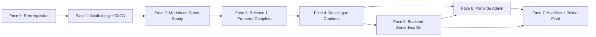

# Plan de Implementación — LectorPobre

> **Versión:** 1.0
> **Documentos base:** [ERS_LectorPobre.md](file:///c:/Users/j_pab/Documents/dev/infoLectorPobre/ERS_LectorPobre.md) · [Arquitectura_Tecnica_Detallada_LectorPobre.md](file:///c:/Users/j_pab/Documents/dev/infoLectorPobre/Arquitectura_Tecnica_Detallada_LectorPobre.md) · [Stack_Tecnologico_LectorPobre.md](file:///c:/Users/j_pab/Documents/dev/infoLectorPobre/Stack_Tecnologico_LectorPobre.md) · [DEVELOPMENT_GUIDELINES.md](file:///c:/Users/j_pab/Documents/dev/infoLectorPobre/DEVELOPMENT_GUIDELINES.md) · [VyV_LectorPobre.md](file:///c:/Users/j_pab/Documents/dev/infoLectorPobre/VyV_LectorPobre.md)
> **Repositorio destino:** `c:\Users\j_pab\Documents\dev\lectorPobre`
> **Objetivo:** Implementar la plataforma LectorPobre de forma incremental sobre arquitectura Jamstack, entregando el catálogo público estático como Release 1 (primera entrega desplegable) y la infraestructura preparada para todas las funcionalidades dinámicas (comentarios, calificaciones, panel de administración).

---

## Resumen Ejecutivo

El plan se divide en **8 fases (0–7)** ordenadas por dependencias. Cada fase tiene entregables concretos y criterios de verificación trazados al ERS. El **Release 1** (Fases 0–4) entrega el catálogo público completamente funcional y desplegado, incluyendo personalización de paleta y variantes visuales. Las fases 5–7 cubren las funcionalidades dinámicas, el panel de administración y el pulido final.

| Fase | Nombre | Alcance | Entregables clave |
|---|---|---|---|
| 0 | Prerrequisitos | Instalaciones manuales y cuentas | Node.js 20, Go 1.22+, Vercel CLI, cuenta Sanity.io, cuenta Vercel |
| 1 | Scaffolding + CI/CD | Organización, docs, configs, automatización | Estructura de carpetas, README, `.gitignore`, Vercel pipeline, Lighthouse CI |
| 2 | Modelo de datos Sanity | Esquemas, Studio, datos de prueba | Esquemas Sanity, Sanity Studio configurado, dataset de staging y producción |
| 3 | Release 1 — Frontend Completo | Nuxt SSG con catálogo, paleta y variantes | Catálogo SSG, SEO, WhatsApp, redes sociales, paleta dinámica (RF-15), variantes visuales (RF-16) |
| 4 | Despliegue Continuo | Vercel + Webhooks de rebuild | CDN global, webhooks de Sanity → Vercel, dominio propio |
| 5 | Backend Serverless — Funciones Go | Lógica dinámica segura | Handlers comentar, calificar, buscar, webhook con Go |
| 6 | Panel de Administración | Login, gestión de catálogo | Autenticación JWT, rutas protegidas, CRUD via Sanity Studio |
| 7 | Analítica, Seguridad y Pulido Final | RNF-06, optimizaciones, hardening | Integración de analítica, checklist de seguridad, optimizaciones de rendimiento |

---

## Decisiones Tomadas

Las siguientes decisiones aplican a todo el plan:

| Decisión | Resolución | Impacto |
|---|---|---|
| Búsqueda (RF-18) | **Client-side sobre dataset hidratado** en Nuxt | Evita función serverless adicional para el Release 1; más rápida en catálogos pequeños/medianos |
| Stock en tiempo real (RF-03) | **Consulta directa del frontend a API pública de Sanity** (sin token secreto) | Sin función Go intermedia para lectura; más eficiente y reduce cold starts |
| Autenticación de administrador | **JWT firmado de corta duración** (< 24h) validado en cada función Go protegida | Compatibilidad con modelo stateless de serverless (RNF-04) |
| Moderación de comentarios | **Estado de borrador** en Sanity; solo se publican al aprobarse desde Studio | Decisión a confirmar con el cliente (Tema Abierto #1 del ERS) |
| Panel de administración | **Sanity Studio** para gestión de contenido (RF-11 a RF-16) + **páginas Nuxt protegidas** para login/logout (RF-08 a RF-10) | Máxima funcionalidad sin desarrollo a medida del CRUD |
| Analítica (RNF-06) | **Plausible Analytics** como default sugerido (privacidad-first, sin cookies, compatible con CSP) | A confirmar con el cliente; fácilmente intercambiable |

---

## Correcciones y Precisiones a la Arquitectura Detectadas

> [!IMPORTANT]
> Los siguientes puntos de la arquitectura requieren precisión o decisión de implementación antes de comenzar la fase correspondiente.

### 1. Autenticación del Administrador no está completamente definida

La arquitectura §4.2 menciona que las funciones Go actúan como proxy seguro, y el Stack §8.1 menciona JWT como mitigación. Sin embargo, no hay un flujo de autenticación de admin completamente definido. Este plan implementa:

- **Login:** función Go `/api/auth/login` que valida usuario/contraseña contra un hash almacenado en variable de entorno de Vercel (no en Sanity dataset público). Emite un JWT firmado con `ADMIN_JWT_SECRET`.
- **Validación por petición:** middleware Go que verifica el JWT en cada función protegida (`/api/admin/*`).
- **Logout:** función Go `/api/auth/logout` que invalida el token (lista negra en memoria efímera o tiempo de expiración corto).

### 2. Panel de administración en Nuxt vs. Sanity Studio

El ERS define RF-08 a RF-10 (login/logout/panel protegido) y RF-11 a RF-16 (edición de contenido). Este plan los implementa de forma híbrida:

- **RF-08, RF-09, RF-10:** páginas Nuxt protegidas con middleware de autenticación client-side + validación server-side en funciones Go.
- **RF-11 a RF-16:** se delegan en gran medida a **Sanity Studio** (interfaz visual sin código), accesible desde un subdominio o embebido. Los cambios disparan el webhook de rebuild.

### 3. CORS no especificado para el entorno de desarrollo

En local con `vercel dev`, el origen es `http://localhost:3000`. El middleware CORS del Go debe permitir este origen en modo desarrollo. La configuración de CORS debe leer la variable de entorno `ALLOWED_ORIGIN` para ser flexible por ambiente.

### 4. Política de moderación de comentarios (Tema Abierto #1)

El ERS deja abierta la decisión sobre si los comentarios requieren moderación. Este plan implementa comentarios con **estado `pendiente`** por defecto en Sanity, con aprobación manual desde Studio, dado que es la opción más segura. Esta decisión debe ser validada con el cliente en la revisión del Hito de Fase 5.

### 5. Umbrales de paginación y stock bajo (Temas Abiertos #2 y #3)

Se usan valores por defecto sensibles:
- Paginación (RF-19): se activa con N > 24 productos.
- Stock bajo (RF-03, RF-14): < 5 unidades = "stock bajo"; 0 = "agotado".

Ambos valores serán configurables desde `configuracionGlobal` en Sanity.

---

## Fase 0 — Prerrequisitos (Configuración Inicial)

**Objetivo:** Verificar e instalar todas las herramientas necesarias y crear las cuentas de servicios de terceros antes de crear cualquier archivo del proyecto.

**Duración estimada:** 30–60 minutos (primera vez)

### 0.1 Herramientas de Desarrollo

| Herramienta | Versión mínima | Propósito | Verificación |
|---|---|---|---|
| **Git** | 2.40+ | Control de versiones | `git --version` |
| **Node.js** | 20 LTS | Nuxt.js, Vitest, Playwright | `node --version` |
| **npm** | 10.x+ (incluido con Node 20) | Gestión de paquetes frontend | `npm --version` |
| **Go** | 1.22+ | Funciones serverless | `go version` |
| **Vercel CLI** | Latest | Desarrollo local y despliegue | `vercel --version` |

#### Instalación en Windows

```powershell
# Git
winget install Git.Git

# Node.js LTS
winget install OpenJS.NodeJS.LTS

# Go
winget install GoLang.Go

# Vercel CLI (tras instalar Node)
npm install -g vercel
```

#### Instalación en macOS

```bash
brew install git go node
npm install -g vercel
```

#### Instalación en Linux (Ubuntu 22.04+)

```bash
# Git y Go
sudo apt-get update && sudo apt-get install -y git golang-go

# Node.js 20 LTS
curl -fsSL https://deb.nodesource.com/setup_20.x | sudo -E bash -
sudo apt-get install -y nodejs

# Vercel CLI
npm install -g vercel
```

### 0.2 Cuentas de Servicios en la Nube

| Servicio | Propósito | URL | Acción requerida |
|---|---|---|---|
| **Sanity.io** | CMS Headless — dataset y Studio | https://sanity.io | Crear cuenta + nuevo proyecto "lectorpobre" |
| **Vercel** | Hosting, CDN, funciones serverless | https://vercel.com | Crear cuenta + conectar con GitHub |
| **GitHub** | Repositorio y CI/CD | https://github.com | Crear repositorio `lectorpobre` (privado inicialmente) |
| **Plausible / Vercel Analytics** | Analítica de tráfico (RNF-06) | https://plausible.io o panel de Vercel | Crear cuenta o habilitar Vercel Analytics |

### 0.3 Configuración de Sanity.io

1. Crear el proyecto en https://sanity.io/manage → "Create new project"
2. Nombre del proyecto: `lectorpobre`
3. Anotar el `projectId` y el nombre del `dataset` (default: `production`)
4. Crear un segundo dataset: `staging` (para pruebas de integración)
5. Generar tokens de API:
   - **Token de solo lectura público** (para el frontend — sin token, usando el modo público de Sanity)
   - **Token de escritura privado** (para las funciones Go) — permisos acotados: solo crear/actualizar `comentario` y `calificacion`

### 0.4 Verificación Completa

```bash
git --version       # >= 2.40
node --version      # >= 20.x
npm --version       # >= 10.x
go version          # >= 1.22
vercel --version    # cualquier versión reciente

# Verificar login en Vercel CLI
vercel whoami
```

- [ ] Todas las herramientas instaladas y en el PATH
- [ ] Cuenta Sanity.io creada con proyecto `lectorpobre` y datasets `production` + `staging`
- [ ] Cuenta Vercel creada y Vercel CLI autenticado
- [ ] Repositorio GitHub creado

---

## Fase 1 — Scaffolding del Repositorio + CI/CD

**Objetivo:** Crear la estructura completa del proyecto y configurar la pipeline de integración continua con Vercel CI + Lighthouse CI desde el primer día.

**Duración estimada:** 1–2 sesiones de trabajo

### 1.1 Estructura de Carpetas

```
lectorpobre/
├── .github/
│   ├── ISSUE_TEMPLATE/
│   │   ├── bug_report.md
│   │   └── feature_request.md
│   ├── PULL_REQUEST_TEMPLATE.md
│   └── workflows/
│       ├── ci.yml              # Tests Go + Vitest + Playwright en PR
│       └── lighthouse.yml      # Lighthouse CI en cada despliegue Preview
│
├── api/                        # Serverless Go functions (Vercel Functions)
│   ├── comment.go              # POST /api/comment (RF-07) — stub inicial
│   ├── rating.go               # POST /api/rating (RF-06) — stub inicial
│   ├── search.go               # GET /api/search (RF-18) — stub inicial
│   ├── auth/
│   │   ├── login.go            # POST /api/auth/login (RF-08) — stub inicial
│   │   └── logout.go           # POST /api/auth/logout (RF-09) — stub inicial
│   ├── webhook/
│   │   └── rebuild.go          # POST /api/webhook/rebuild — stub inicial
│   ├── handlers/               # Shared types and helpers
│   │   ├── types.go            # CommentPayload, ApiResponse, etc.
│   │   └── validation.go       # Reusable validation functions
│   ├── sanity/
│   │   └── client.go           # Sanity client with private token
│   ├── middleware/
│   │   ├── cors.go             # CORS restricted to production domain
│   │   ├── ratelimit.go        # Rate limiting per IP
│   │   └── hmac.go             # HMAC signature verification for webhooks
│   ├── constants/
│   │   └── errorcodes.go       # Centralized error codes
│   └── go.mod
│
├── components/                 # Reusable Vue components
│   ├── ProductCard.vue
│   ├── StarRating.vue
│   ├── CommentForm.vue
│   ├── WhatsAppButton.vue
│   ├── PrimaryButton.vue
│   └── StockIndicator.vue
│
├── composables/                # Vue business logic (composables)
│   ├── useStock.ts             # RF-03, RNF-03
│   ├── useRating.ts            # RF-06
│   ├── useComment.ts           # RF-07
│   └── useCatalog.ts           # RF-01, RF-04, RF-18
│
├── pages/                      # Site routes (SSG, file-based routing)
│   ├── index.vue               # Main catalog (RF-01, RF-04, RF-19)
│   ├── product/
│   │   └── [slug].vue          # Product detail (RF-02, RF-03, RF-20)
│   └── admin/
│       └── login.vue           # Admin login (RF-08)
│
├── layouts/
│   ├── default.vue             # Public layout (catalog)
│   └── admin.vue               # Admin panel layout
│
├── middleware/                 # Nuxt middleware (protected routes)
│   └── auth.ts                 # Redirects to login if no session (RF-10)
│
├── types/                      # Global TypeScript types
│   ├── api.ts                  # API contracts (mirror of handlers/types.go)
│   └── sanity.ts               # Sanity data model types
│
├── sanity/                     # Sanity Studio configuration
│   ├── sanity.config.ts
│   └── schemas/
│       ├── index.ts
│       ├── product.ts
│       ├── category.ts
│       ├── comment.ts
│       ├── rating.ts
│       └── globalConfig.ts
│
├── assets/
│   └── css/
│       └── global.css          # Custom properties and design tokens
│
├── public/
│   └── favicon.svg
│
├── tests/
│   ├── unit/                   # Vitest unit tests
│   ├── e2e/                    # Playwright E2E tests
│   └── fixtures/               # Reusable test data
│
├── docs/
│   ├── ERS_LectorPobre.md
│   ├── Arquitectura_Tecnica_Detallada_LectorPobre.md
│   ├── Stack_Tecnologico_LectorPobre.md
│   ├── DEVELOPMENT_GUIDELINES.md
│   ├── VyV_LectorPobre.md      # Test plan
│   └── implementationPlan.md   # This document
│
├── .env.example
├── .gitignore
├── .editorconfig
├── nuxt.config.ts
├── tailwind.config.ts
├── tsconfig.json
├── vercel.json
├── lighthouserc.json
├── playwright.config.ts
├── vitest.config.ts
├── README.md
└── CHANGELOG.md
```

### 1.2 Archivos de Configuración y Documentación

#### `README.md`

- Descripción del proyecto y stack tecnológico (con badges de Vercel, Nuxt.js, Go, Sanity)
- Tabla de contenidos
- Guía rápida de instalación (`npm install`, `vercel dev`)
- Estructura del proyecto
- Variables de entorno requeridas (referencia a `.env.example`)
- Referencia a `docs/` para documentación detallada
- Sección de contribución

#### `.gitignore`

```gitignore
# Node
node_modules/
.nuxt/
dist/
.output/
.vercel/
*.log

# Go
api/vendor/

# Sanity
.sanity/

# Environment
.env
.env.local
.env.*.local

# IDE
.vscode/
.idea/
*.swp

# OS
.DS_Store
Thumbs.db

# Coverage y tests
coverage/
playwright-report/
test-results/
```

#### `.editorconfig`

```editorconfig
root = true

[*]
indent_style = space
end_of_line = lf
charset = utf-8
trim_trailing_whitespace = true
insert_final_newline = true

[*.go]
indent_size = 4

[*.{ts,vue,json,yaml,yml}]
indent_size = 2
```

#### `vercel.json`

```json
{
  "framework": "nuxtjs",
  "functions": {
    "api/**/*.go": {
      "runtime": "go1.x"
    }
  },
  "rewrites": [
    { "source": "/api/(.*)", "destination": "/api/$1" }
  ],
  "headers": [
    {
      "source": "/(.*)",
      "headers": [
        { "key": "X-Content-Type-Options", "value": "nosniff" },
        { "key": "X-Frame-Options", "value": "SAMEORIGIN" },
        { "key": "Referrer-Policy", "value": "strict-origin-when-cross-origin" },
        { "key": "Strict-Transport-Security", "value": "max-age=63072000; includeSubDomains; preload" }
      ]
    }
  ]
}
```

#### `.env.example`

```bash
# ── Sanity.io (valores PÚBLICOS — seguros para el frontend) ─────────────────
NUXT_PUBLIC_SANITY_PROJECT_ID=tu_project_id
NUXT_PUBLIC_SANITY_DATASET=production

# ── Sanity.io (valores PRIVADOS — solo funciones Go en Vercel) ──────────────
# ⚠️ NUNCA exponer al frontend ni commitear este valor
SANITY_WRITE_TOKEN=

# ── Webhooks ────────────────────────────────────────────────────────────────
SANITY_WEBHOOK_SECRET=

# ── Autenticación del Administrador ─────────────────────────────────────────
# Hash bcrypt de la contraseña del administrador
ADMIN_PASSWORD_HASH=
# Secreto para firmar JWT — usar string larga y aleatoria
ADMIN_JWT_SECRET=

# ── Anti-bot (opcional) ─────────────────────────────────────────────────────
CAPTCHA_SECRET_KEY=

# ── CORS ────────────────────────────────────────────────────────────────────
# En producción: https://lectorpobre.com
# En desarrollo: http://localhost:3000
ALLOWED_ORIGIN=http://localhost:3000

# ── Analítica (opcional) ────────────────────────────────────────────────────
NUXT_PUBLIC_PLAUSIBLE_DOMAIN=lectorpobre.com
```

### 1.3 Inicialización de Proyectos

```bash
# 1. Inicializar proyecto Nuxt.js 3
npx nuxi@latest init ./ --package-manager npm

# 2. Instalar dependencias del frontend
npm install @nuxtjs/tailwindcss @nuxtjs/sanity
npm install -D vitest @vue/test-utils @vitest/coverage-v8 playwright @playwright/test msw

# 3. Inicializar Tailwind
npx tailwindcss init

# 4. Inicializar módulo Go
mkdir api && cd api
go mod init github.com/tu-org/lectorpobre/api
go get github.com/stretchr/testify
cd ..

# 5. Inicializar Sanity Studio en el proyecto
npm create sanity@latest -- --project TU_PROJECT_ID --dataset production --output-path sanity/
```

### 1.4 GitHub Actions — CI Pipeline

#### `.github/workflows/ci.yml`

```yaml
name: CI — Tests + Build

on:
  push:
    branches: [main, develop]
  pull_request:
    branches: [main]

jobs:
  test-backend:
    runs-on: ubuntu-latest
    steps:
      - uses: actions/checkout@v4
      - uses: actions/setup-go@v5
        with:
          go-version: '1.22'
      - name: Run Go tests with coverage
        working-directory: api
        run: go test ./... -v -cover -coverprofile=coverage.out
      - name: Go vet
        working-directory: api
        run: go vet ./...

  test-frontend:
    runs-on: ubuntu-latest
    steps:
      - uses: actions/checkout@v4
      - uses: actions/setup-node@v4
        with:
          node-version: '20'
          cache: 'npm'
      - run: npm ci
      - name: Run Vitest unit tests with coverage
        run: npm run test -- --coverage --run
      - name: Build Nuxt (SSG)
        run: npm run generate
        env:
          NUXT_PUBLIC_SANITY_PROJECT_ID: ${{ secrets.SANITY_PROJECT_ID_STAGING }}
          NUXT_PUBLIC_SANITY_DATASET: staging

  e2e-tests:
    needs: [test-backend, test-frontend]
    runs-on: ubuntu-latest
    steps:
      - uses: actions/checkout@v4
      - uses: actions/setup-node@v4
        with:
          node-version: '20'
      - run: npm ci
      - name: Install Playwright browsers
        run: npx playwright install --with-deps chromium
      - name: Run Playwright E2E tests
        run: npx playwright test
        env:
          BASE_URL: ${{ secrets.VERCEL_PREVIEW_URL }}
```

#### `.github/workflows/lighthouse.yml`

```yaml
name: Lighthouse CI

on:
  deployment_status:

jobs:
  lighthouse:
    if: github.event.deployment_status.state == 'success'
    runs-on: ubuntu-latest
    steps:
      - uses: actions/checkout@v4
      - uses: actions/setup-node@v4
        with:
          node-version: '20'
      - run: npm install -g @lhci/cli
      - name: Run Lighthouse CI
        run: lhci autorun
        env:
          LHCI_GITHUB_APP_TOKEN: ${{ secrets.LHCI_GITHUB_APP_TOKEN }}
          LHCI_BUILD_CONTEXT__CURRENT_BRANCH: ${{ github.ref_name }}
```

#### `lighthouserc.json`

```json
{
  "ci": {
    "collect": {
      "url": ["$BASE_URL", "$BASE_URL/producto/producto-de-prueba"],
      "numberOfRuns": 3
    },
    "assert": {
      "assertions": {
        "categories:performance": ["error", { "minScore": 0.9 }],
        "categories:accessibility": ["error", { "minScore": 0.9 }],
        "categories:seo": ["error", { "minScore": 0.9 }],
        "categories:best-practices": ["warn", { "minScore": 0.85 }]
      }
    }
  }
}
```

### 1.5 Stubs de Funciones Go

Crear stubs para todos los handlers Go con `TODO` referenciando el RF correspondiente. Esto permite que el repositorio compile desde el día 1.

```go
// api/comentar.go — stub inicial
// TODO(RF-07): Implementar validación, rate limiting y escritura en Sanity. Issue #5.
package handler

import "net/http"

func Handler(w http.ResponseWriter, r *http.Request) {
    w.Header().Set("Content-Type", "application/json")
    w.WriteHeader(http.StatusNotImplemented)
    w.Write([]byte(`{"error":"no implementado"}`))
}
```

### 1.6 Branch Protection y Templates

1. **Branch protection en `main`:**
   - Requerir PR para merge (no push directo)
   - Requerir que CI pase antes de merge
   - Requerir al menos 1 aprobación

2. **`PULL_REQUEST_TEMPLATE.md`** — checklist que incluye:
   - [ ] El código compila y los tests pasan localmente
   - [ ] Se agregó GoDoc/JSDoc a funciones públicas
   - [ ] Se referencia el RF/RNF correspondiente
   - [ ] No se introdujeron secretos en el código
   - [ ] CORS correctamente configurado en handlers nuevos
   - [ ] El checklist completo de `CONTRIBUTING.md` fue verificado

### 1.7 Verificación

- [ ] `npm run dev` arranca el servidor de Nuxt en modo desarrollo
- [ ] `cd api && go build ./...` compila sin errores
- [ ] `cd api && go test ./...` pasa (stubs)
- [ ] `npm run test` pasa (tests vacíos iniciales)
- [ ] Push a `develop` activa el workflow de CI
- [ ] La estructura de carpetas coincide con el árbol definido arriba
- [ ] Primer commit: `chore(repo): scaffold project structure, CI/CD pipeline and documentation`

---

## Fase 2 — Modelo de Datos Sanity

**Objetivo:** Definir los esquemas de datos en Sanity.io, configurar Sanity Studio y cargar datos de prueba en el dataset de staging para que las fases siguientes tengan datos reales con qué trabajar.

**Duración estimada:** 1–2 sesiones de trabajo  
**Satisface:** Fundamentos para RF-01 a RF-07, RF-11 a RF-16 · Estructura para todos los flujos de datos

### 2.1 Esquemas de Sanity

#### `sanity/schemas/producto.ts`

```typescript
// Satisfies: RF-01 (Catálogo), RF-02 (Detalle), RF-11 (Edición), RF-12 (Imagen),
//            RF-13 (Crear/eliminar), RF-14 (Stock)
import { defineType, defineField } from 'sanity';

export const producto = defineType({
    name: 'producto',
    title: 'Producto',
    type: 'document',
    fields: [
        defineField({ name: 'nombre', type: 'string', validation: Rule => Rule.required() }),
        defineField({ name: 'slug', type: 'slug', options: { source: 'nombre' }, validation: Rule => Rule.required() }),
        defineField({ name: 'descripcion', type: 'text' }),
        defineField({ name: 'imagenPrincipal', type: 'image', options: { hotspot: true } }),
        defineField({ name: 'imagenes', type: 'array', of: [{ type: 'image' }] }),
        defineField({
            name: 'categoria',
            type: 'reference',
            to: [{ type: 'categoria' }],
            validation: Rule => Rule.required()
        }),
        defineField({
            name: 'stock',
            type: 'number',
            validation: Rule => Rule.required().min(0).integer()
        }),
        defineField({ name: 'precio', type: 'number' }),          // Opcional, para el mensaje de WhatsApp
        defineField({ name: 'activo', type: 'boolean', initialValue: true }),
        defineField({ name: 'calificacionPromedio', type: 'number', readOnly: true }), // Calculado
        defineField({ name: 'totalCalificaciones', type: 'number', readOnly: true }),  // Calculado
    ],
    preview: {
        select: { title: 'nombre', subtitle: 'categoria.nombre', media: 'imagenPrincipal' }
    }
});
```

#### `sanity/schemas/categoria.ts`

```typescript
// Satisfies: RF-04 (Categorías)
export const categoria = defineType({
    name: 'categoria',
    title: 'Categoría',
    type: 'document',
    fields: [
        defineField({ name: 'nombre', type: 'string', validation: Rule => Rule.required() }),
        defineField({ name: 'slug', type: 'slug', options: { source: 'nombre' } }),
        defineField({ name: 'descripcion', type: 'text' }),
        defineField({ name: 'orden', type: 'number' }),           // Para ordenar categorías en UI
    ]
});
```

#### `sanity/schemas/comentario.ts`

```typescript
// Satisfies: RF-07 (Comentarios). Estado de moderación incluido.
export const comentario = defineType({
    name: 'comentario',
    title: 'Comentario',
    type: 'document',
    fields: [
        defineField({ name: 'texto', type: 'text', validation: Rule => Rule.required().max(1000) }),
        defineField({ name: 'producto', type: 'reference', to: [{ type: 'producto' }], validation: Rule => Rule.required() }),
        defineField({ name: 'fechaCreacion', type: 'datetime' }),
        defineField({
            name: 'estado',
            type: 'string',
            options: { list: ['pendiente', 'aprobado', 'rechazado'] },
            initialValue: 'pendiente'
        }),
    ]
});
```

#### `sanity/schemas/calificacion.ts`

```typescript
// Satisfies: RF-06 (Calificación por estrellas)
export const calificacion = defineType({
    name: 'calificacion',
    title: 'Calificación',
    type: 'document',
    fields: [
        defineField({ name: 'valor', type: 'number', validation: Rule => Rule.required().min(1).max(5).integer() }),
        defineField({ name: 'producto', type: 'reference', to: [{ type: 'producto' }], validation: Rule => Rule.required() }),
        defineField({ name: 'fechaCreacion', type: 'datetime' }),
    ]
});
```

#### `sanity/schemas/configuracionGlobal.ts`

```typescript
// Satisfies: RF-05 (Redes sociales), RF-15 (Paleta colores), RF-16 (Variantes visuales), RF-17 (WhatsApp)
export const configuracionGlobal = defineType({
    name: 'configuracionGlobal',
    title: 'Configuración Global del Sitio',
    type: 'document',
    fields: [
        defineField({ name: 'nombreSitio', type: 'string' }),
        defineField({ name: 'numeroWhatsApp', type: 'string' }),         // RF-17: ej. "5219991234567"
        defineField({ name: 'mensajeWhatsApp', type: 'text' }),          // RF-17: template del mensaje
        defineField({ name: 'urlInstagram', type: 'url' }),              // RF-05
        defineField({ name: 'urlFacebook', type: 'url' }),               // RF-05
        defineField({ name: 'urlTikTok', type: 'url' }),                 // RF-05
        defineField({                                                      // RF-15
            name: 'paletaActiva',
            type: 'string',
            options: { list: ['azul', 'verde', 'morado', 'naranja', 'gris'] },
            initialValue: 'azul'
        }),
        defineField({                                                      // RF-16
            name: 'varianteVisual',
            type: 'string',
            options: { list: ['clasico', 'moderno', 'minimalista'] },
            initialValue: 'moderno'
        }),
        defineField({ name: 'umbralStockBajo', type: 'number', initialValue: 5 }),    // RF-03, RF-14
        defineField({ name: 'productosPorPagina', type: 'number', initialValue: 24 }), // RF-19
    ],
    // Solo puede existir un documento de configuración global
    __experimental_actions: ['update', 'publish'],
});
```

### 2.2 Configuración de Sanity Studio

```typescript
// sanity/sanity.config.ts
import { defineConfig } from 'sanity';
import { structureTool } from 'sanity/structure';
import { visionTool } from '@sanity/vision';
import { producto, categoria, comentario, calificacion, configuracionGlobal } from './schemas';

export default defineConfig({
    projectId: process.env.SANITY_STUDIO_PROJECT_ID!,
    dataset: process.env.SANITY_STUDIO_DATASET ?? 'production',
    plugins: [structureTool(), visionTool()],
    schema: {
        types: [producto, categoria, comentario, calificacion, configuracionGlobal]
    }
});
```

### 2.3 Tipos TypeScript desde Sanity (`types/sanity.ts`)

```typescript
// Tipos generados a partir de los schemas de Sanity
// Para producción, usar `npx sanity@latest typegen generate`

export interface Producto {
    _id: string;
    _type: 'producto';
    nombre: string;
    slug: { current: string };
    descripcion?: string;
    imagenPrincipal?: SanityImage;
    imagenes?: SanityImage[];
    categoria: { _ref: string; nombre: string };
    stock: number;
    precio?: number;
    activo: boolean;
    calificacionPromedio?: number;
    totalCalificaciones?: number;
}

export interface Categoria {
    _id: string;
    nombre: string;
    slug: { current: string };
    descripcion?: string;
    orden?: number;
}

export interface ConfiguracionGlobal {
    numeroWhatsApp: string;
    mensajeWhatsApp?: string;
    urlInstagram?: string;
    urlFacebook?: string;
    urlTikTok?: string;
    paletaActiva: 'azul' | 'verde' | 'morado' | 'naranja' | 'gris';
    varianteVisual: 'clasico' | 'moderno' | 'minimalista';
    umbralStockBajo: number;
    productosPorPagina: number;
}
```

### 2.4 Carga de Datos de Prueba en Staging

Crear al menos 10 productos de prueba en el dataset `staging` con:
- Mínimo 3 categorías distintas
- Stock variado (0, bajo, alto)
- 1 documento de `configuracionGlobal` con todos los campos

### 2.5 Configuración del Webhook de Sanity

1. En https://sanity.io/manage → tu proyecto → API → Webhooks:
   - **URL:** `https://[tu-proyecto].vercel.app/api/webhook/rebuild`
   - **Trigger on:** Create, Update, Delete
   - **Dataset:** production
   - **Secret:** copiar el valor de `SANITY_WEBHOOK_SECRET`

2. Configurar el mismo webhook para el dataset `staging` apuntando a la URL de Preview.

### 2.6 Tests de Integración de Datos (Modelo en V)

> [!NOTE]
> Siguiendo el **Modelo en V**, los tests de integración de datos se definen y ejecutan inmediatamente después de implementar los esquemas, antes de pasar a la Fase 3. Esto garantiza que el contrato de datos entre Sanity y el frontend sea correcto desde el inicio.

Crear los siguientes tests en `tests/unit/sanity-schemas.test.ts`:
- Verificar que los tipos TypeScript generados en `types/sanity.ts` coincidan con los schemas de Sanity (IT-SANITY-01).
- Verificar que las consultas GROQ básicas (`*[_type == "product"]`) retornan la estructura de campos esperada contra el dataset `staging` (IT-SANITY-02).
- Verificar que un documento `globalConfig` con `activepalette` y `visualVariant` puede ser consultado correctamente (IT-SANITY-03).

```bash
npm run test -- tests/unit/sanity-schemas.test.ts
```

### 2.7 Verificación

- [ ] `cd sanity && npx sanity dev` arranca Sanity Studio sin errores
- [ ] Los 5 tipos de documento aparecen en el Studio
- [ ] Se pueden crear y editar productos, categorías y la configuración global
- [ ] El dataset de staging tiene al menos 10 productos con datos completos
- [ ] Los tipos TypeScript en `types/sanity.ts` coinciden con los schemas de Sanity
- [ ] Tests de integración de datos pasan (`npm run test -- tests/unit/sanity-schemas.test.ts`)
- [ ] Commit: `feat(sanity): define data schemas, studio config, staging seed data and integration tests`

---

## Fase 3 — Release 1 — Frontend Completo

**Objetivo:** Implementar el frontend completo con Nuxt.js SSG consumiendo datos reales de Sanity, incluyendo personalización de paleta de colores (RF-15) y variantes visuales (RF-16). Al finalizar esta fase, el catálogo público es completamente funcional como sitio estático con todas sus funcionalidades de presentación.

**Duración estimada:** 4–5 sesiones de trabajo  
**Satisface:** RF-01, RF-02, RF-04, RF-05, RF-15, RF-16, RF-17, RF-18, RF-19, RF-20 · RNF-01, RNF-02, RNF-05

### 3.1 Sistema de Diseño (`assets/css/global.css` + `tailwind.config.ts`)

1. **Configurar Tailwind** con tokens de marca:
   - Token `brand` usando CSS custom properties (para soportar cambio de paleta RF-15)
   - `darkMode: 'class'` para soporte de modo oscuro
   - Fuente moderna desde Google Fonts (Outfit o Inter)

2. **`assets/css/global.css`:**

```css
@import url('https://fonts.googleapis.com/css2?family=Outfit:wght@300;400;500;600;700&display=swap');

:root {
    /* Paleta Azul (default — RF-15) */
    --color-brand-50: #eff6ff;
    --color-brand-100: #dbeafe;
    --color-brand-500: #3b82f6;
    --color-brand-600: #2563eb;
    --color-brand-700: #1d4ed8;

    /* Tipografía */
    --font-sans: 'Outfit', system-ui, sans-serif;

    /* Transiciones */
    --transition-base: 200ms ease-in-out;
}

/* Las paletas de color de RF-15 se inyectan dinámicamente desde nuxt.config.ts
   según el valor de paletaActiva en configuracionGlobal de Sanity */
```

3. **`tailwind.config.ts`:**

```typescript
export default {
    content: ['./components/**/*.vue', './pages/**/*.vue', './layouts/**/*.vue'],
    darkMode: 'class',
    theme: {
        fontFamily: { sans: ['Outfit', 'system-ui', 'sans-serif'] },
        extend: {
            colors: {
                brand: {
                    50:  'var(--color-brand-50)',
                    100: 'var(--color-brand-100)',
                    500: 'var(--color-brand-500)',
                    600: 'var(--color-brand-600)',
                    700: 'var(--color-brand-700)',
                }
            }
        }
    }
};
```

### 3.2 Plugin de Sanity en Nuxt (`nuxt.config.ts`)

```typescript
// nuxt.config.ts
export default defineNuxtConfig({
    modules: ['@nuxtjs/tailwindcss', '@nuxtjs/sanity'],
    sanity: {
        projectId: process.env.NUXT_PUBLIC_SANITY_PROJECT_ID,
        dataset: process.env.NUXT_PUBLIC_SANITY_DATASET,
        useCdn: true,           // CDN de Sanity para lecturas en build time
        apiVersion: '2024-01-01',
    },
    nitro: {
        preset: 'vercel-static' // Generar sitio estático para Vercel
    },
    app: {
        head: {
            htmlAttrs: { lang: 'es' },
            meta: [
                { name: 'viewport', content: 'width=device-width, initial-scale=1' }
            ]
        }
    }
});
```

### 3.3 Composable del Catálogo (`composables/useCatalogo.ts`)

```typescript
/**
 * @file useCatalogo.ts
 * @description Composable que expone el catálogo de productos para el SSG.
 * Los datos son consultados en build time y pre-renderizados en HTML estático.
 * @satisfies RF-01 (Catálogo), RF-04 (Categorías), RF-18 (Búsqueda client-side), RF-19 (Paginación)
 */

export function useCatalogo(config: { pagina?: number; categoria?: string } = {}) {
    const sanity = useSanityClient();

    // Consulta ejecutada en build time (SSG) o en cliente para SSR ligero
    const { data: productos } = useSanityFetch<Producto[]>(
        `*[_type == "producto" && activo == true ${config.categoria ? '&& categoria->slug.current == $categoria' : ''}]
         | order(_createdAt desc)
         { _id, nombre, slug, descripcion, imagenPrincipal, categoria->{nombre,slug}, stock, calificacionPromedio }`,
        config.categoria ? { categoria: config.categoria } : {}
    );

    // Búsqueda client-side sobre los datos ya cargados (RF-18)
    const query = ref('');
    const productosFiltrados = computed(() =>
        query.value
            ? productos.value?.filter(p =>
                p.nombre.toLowerCase().includes(query.value.toLowerCase()) ||
                p.descripcion?.toLowerCase().includes(query.value.toLowerCase())
            )
            : productos.value
    );

    return { productos, productosFiltrados, query };
}
```

### 3.4 Página Principal (`pages/index.vue`)

```vue
<script setup lang="ts">
/**
 * @file pages/index.vue
 * @description Página principal — catálogo de productos.
 * @satisfies RF-01, RF-04, RF-18, RF-19, RNF-01, RNF-02, RNF-05
 */

useSeoMeta({
    title: 'LectorPobre — Catálogo de Productos',
    description: 'Explora nuestro catálogo completo de productos. Envío directo por WhatsApp.',
    ogTitle: 'LectorPobre — Catálogo de Productos',
});

const { productosFiltrados, query } = useCatalogo();
const { data: categorias } = useSanityFetch<Categoria[]>(
    `*[_type == "categoria"] | order(orden asc) { _id, nombre, slug }`
);

const categoriaActiva = ref<string | null>(null);
</script>

<template>
    <div class="min-h-screen bg-gray-50 dark:bg-gray-900">
        <!-- Header con búsqueda (RF-18) -->
        <header class="sticky top-0 z-10 bg-white/80 dark:bg-gray-900/80 backdrop-blur border-b border-gray-200 dark:border-gray-700">
            <div class="max-w-7xl mx-auto px-4 py-3 flex items-center gap-4">
                <h1 class="text-xl font-bold text-brand-600">LectorPobre</h1>
                <input
                    v-model="query"
                    type="search"
                    placeholder="Buscar productos..."
                    aria-label="Buscar productos"
                    class="flex-1 px-4 py-2 rounded-xl border border-gray-200 dark:border-gray-700 bg-gray-50 dark:bg-gray-800 text-sm focus-visible:outline-none focus-visible:ring-2 focus-visible:ring-brand-500"
                />
                <!-- Redes sociales (RF-05) — datos desde configuracionGlobal -->
                <nav aria-label="Redes sociales">
                    <!-- Iconos de redes sociales -->
                </nav>
            </div>
        </header>

        <!-- Filtros por categoría (RF-04) -->
        <section aria-label="Filtrar por categoría" class="max-w-7xl mx-auto px-4 py-4 flex gap-2 flex-wrap">
            <button
                v-for="cat in categorias"
                :key="cat._id"
                @click="categoriaActiva = cat.slug.current"
                :aria-pressed="categoriaActiva === cat.slug.current"
                class="px-4 py-1.5 rounded-full text-sm font-medium transition-colors focus-visible:ring-2 focus-visible:ring-brand-500"
                :class="categoriaActiva === cat.slug.current ? 'bg-brand-600 text-white' : 'bg-white text-gray-700 hover:bg-brand-50'"
            >
                {{ cat.nombre }}
            </button>
        </section>

        <!-- Grilla de productos (RF-01) -->
        <main class="max-w-7xl mx-auto px-4 pb-12">
            <div class="grid grid-cols-1 sm:grid-cols-2 md:grid-cols-3 lg:grid-cols-4 gap-6">
                <TarjetaProducto
                    v-for="producto in productosFiltrados"
                    :key="producto._id"
                    :producto="producto"
                />
            </div>
        </main>
    </div>
</template>
```

### 3.5 Componente `TarjetaProducto.vue`

```vue
<script setup lang="ts">
/**
 * @file TarjetaProducto.vue
 * @description Tarjeta de producto para el catálogo.
 * @satisfies RF-01 (Catálogo), RF-02 (Detalle), RNF-05 (Responsividad)
 */
interface Props {
    producto: Producto;
}
const props = defineProps<Props>();
</script>

<template>
    <article
        class="group bg-white dark:bg-gray-800 rounded-2xl shadow-sm hover:shadow-md
               transition-shadow duration-200 overflow-hidden cursor-pointer"
    >
        <NuxtLink :to="`/producto/${producto.slug.current}`" class="block">
            <!-- Imagen del producto -->
            <div class="aspect-square overflow-hidden bg-gray-100 dark:bg-gray-700">
                <SanityImage
                    v-if="producto.imagenPrincipal"
                    :asset-id="producto.imagenPrincipal.asset._ref"
                    :alt="producto.nombre"
                    class="w-full h-full object-cover group-hover:scale-105 transition-transform duration-300"
                    width="400"
                    height="400"
                />
                <div v-else class="w-full h-full flex items-center justify-center text-gray-400">
                    Sin imagen
                </div>
            </div>

            <!-- Información del producto -->
            <div class="p-4">
                <h2 class="font-semibold text-gray-900 dark:text-gray-100 line-clamp-2 mb-2">
                    {{ producto.nombre }}
                </h2>
                <div class="flex items-center justify-between">
                    <span class="text-xs text-brand-600 font-medium">{{ producto.categoria.nombre }}</span>
                    <IndicadorStock :stock="producto.stock" compact />
                </div>
            </div>
        </NuxtLink>
    </article>
</template>
```

### 3.6 Página de Detalle de Producto (`pages/producto/[slug].vue`)

```vue
<script setup lang="ts">
/**
 * @file pages/producto/[slug].vue
 * @description Página de detalle de producto con stock en tiempo real.
 * @satisfies RF-02 (Detalle), RF-03 (Stock real), RF-06 (Calificación),
 *            RF-07 (Comentarios), RF-17 (WhatsApp), RF-20 (SEO/OG), RNF-03
 */

const route = useRoute();
const { data: producto } = await useSanityFetch<Producto>(
    `*[_type == "producto" && slug.current == $slug][0]
     { _id, nombre, descripcion, imagenPrincipal, imagenes, categoria->{nombre}, stock, calificacionPromedio }`,
    { slug: route.params.slug }
);

// Genera rutas estáticas para todos los productos (SSG)
defineRouteRules({ prerender: true });

// Stock en tiempo real — consulta directa a Sanity sin token (RF-03, RNF-03)
const { stock, cargando: cargandoStock } = useStock(producto.value?._id ?? '');

// SEO y Open Graph (RF-20)
useSeoMeta({
    title: () => `${producto.value?.nombre} | LectorPobre`,
    description: () => producto.value?.descripcion?.slice(0, 160) ?? '',
    ogTitle: () => producto.value?.nombre ?? '',
    ogImage: () => producto.value?.imagenPrincipal ? urlFor(producto.value.imagenPrincipal).width(1200).url() : '',
    twitterCard: 'summary_large_image',
});

// URL de WhatsApp (RF-17)
const { data: config } = useSanityFetch<ConfiguracionGlobal>(
    `*[_type == "configuracionGlobal"][0]{ numeroWhatsApp, mensajeWhatsApp }`
);

const urlWhatsApp = computed(() =>
    construirUrlWhatsApp(config.value?.numeroWhatsApp ?? '', producto.value?.nombre ?? '', config.value?.mensajeWhatsApp)
);
</script>

<template>
    <div v-if="producto" class="max-w-4xl mx-auto px-4 py-8">
        <div class="grid grid-cols-1 md:grid-cols-2 gap-8">
            <!-- Galería de imágenes -->
            <div>...</div>

            <!-- Información del producto -->
            <div class="space-y-4">
                <h1 class="text-2xl font-bold text-gray-900 dark:text-gray-100">
                    {{ producto.nombre }}
                </h1>

                <!-- Stock en tiempo real (RF-03) -->
                <IndicadorStock :stock="stock ?? producto.stock" :cargando="cargandoStock" />

                <p class="text-gray-600 dark:text-gray-400">{{ producto.descripcion }}</p>

                <!-- Calificación (RF-06) -->
                <SistemaEstrellas
                    :producto-id="producto._id"
                    :calificacion-promedio="producto.calificacionPromedio"
                />

                <!-- Botón WhatsApp (RF-17) -->
                <BotonWhatsApp :href="urlWhatsApp" />

                <!-- Comentarios (RF-07) -->
                <FormularioComentario :producto-id="producto._id" />
            </div>
        </div>
    </div>
</template>
```

### 3.7 Generación de Rutas Estáticas

```typescript
// nuxt.config.ts — agregar configuración de generación
export default defineNuxtConfig({
    // ...
    nitro: {
        preset: 'vercel-static',
        prerender: {
            crawlLinks: true,
            routes: ['/'],
        }
    },
    // Generación dinámica de rutas de productos
    hooks: {
        async 'nitro:config'(nitroConfig) {
            // Se generan rutas dinámicamente en build time a partir de Sanity
        }
    }
});
```

### 3.8 Componentes Restantes

Crear los siguientes componentes con su funcionalidad básica:
- `IndicadorStock.vue` — muestra estado de stock (RF-03)
- `BotonWhatsApp.vue` — enlace a WhatsApp (RF-17)
- `SistemaEstrellas.vue` — muestra calificación promedio (UI solo, sin lógica de envío aún)
- `FormularioComentario.vue` — formulario con validación client-side (sin envío aún)
- `BotonPrimario.vue` — botón reutilizable

### 3.9 Personalización de Paleta de Colores (RF-15)

Implementar el sistema de paleta dinámica que lee `paletaActiva` de `configuracionGlobal` en Sanity y aplica los tokens CSS correspondientes en el build.

```typescript
// plugins/paleta.ts — Plugin de Nuxt ejecutado en build time
// Satisfies: RF-15 (Personalización de paleta de colores)
export default defineNuxtPlugin(async () => {
    const { data: config } = await useSanityFetch<{ paletaActiva: string }>(
        `*[_type == "configuracionGlobal"][0]{ paletaActiva }`
    );

    const paletas: Record<string, Record<string, string>> = {
        azul:    { '--color-brand-500': '#3b82f6', '--color-brand-600': '#2563eb', '--color-brand-700': '#1d4ed8' },
        verde:   { '--color-brand-500': '#22c55e', '--color-brand-600': '#16a34a', '--color-brand-700': '#15803d' },
        morado:  { '--color-brand-500': '#a855f7', '--color-brand-600': '#9333ea', '--color-brand-700': '#7e22ce' },
        naranja: { '--color-brand-500': '#f97316', '--color-brand-600': '#ea580c', '--color-brand-700': '#c2410c' },
        gris:    { '--color-brand-500': '#6b7280', '--color-brand-600': '#4b5563', '--color-brand-700': '#374151' },
    };

    const tokens = paletas[config.value?.paletaActiva ?? 'azul'];
    // Inyectar los tokens en el :root durante el SSG — el CSS custom property
    // es leído por tailwind.config.ts en tiempo de ejecución (RF-15, §6.5 Guidelines)
    useHead({
        style: [{ children: `:root { ${Object.entries(tokens).map(([k, v]) => `${k}:${v}`).join(';')} }` }]
    });
});
```

El administrador cambia la paleta desde `configuracionGlobal` en Sanity Studio → el webhook dispara un rebuild → la nueva paleta se aplica en el siguiente deploy.

### 3.10 Variantes Visuales (RF-16)

Implementar 3 variantes visuales controladas por `varianteVisual` en `configuracionGlobal`. Cada variante es una clase en el elemento `<html>` que el plugin lee en build time:

```typescript
// plugins/variante.ts — Plugin de Nuxt ejecutado en build time
// Satisfies: RF-16 (Variantes visuales del catálogo)
export default defineNuxtPlugin(async () => {
    const { data: config } = await useSanityFetch<{ varianteVisual: string }>(
        `*[_type == "configuracionGlobal"][0]{ varianteVisual }`
    );

    // La variante se aplica como clase en <html> para que los estilos sean
    // intercambiables desde CSS con [.variante-*] selectors
    useHead({
        htmlAttrs: { class: `variante-${config.value?.varianteVisual ?? 'moderno'}` }
    });
});
```

Definir en `assets/css/global.css` los estilos de cada variante:

```css
/* RF-16: Variante clásico — layout de lista, tipografía con mayor peso */
.variante-clasico .tarjeta-producto { @apply rounded-md shadow-none border border-gray-200; }
.variante-clasico h1, .variante-clasico h2 { font-weight: 700; letter-spacing: -0.02em; }

/* RF-16: Variante moderno — grid de tarjetas (default) */
.variante-moderno .tarjeta-producto { @apply rounded-2xl shadow-sm hover:shadow-md; }

/* RF-16: Variante minimalista — sin sombras, bordes sutiles */
.variante-minimalista .tarjeta-producto { @apply rounded-none border-b border-gray-200 shadow-none; }
.variante-minimalista { @apply font-mono; }
```

### 3.11 Tests Unitarios de Frontend (Modelo en V)

> [!NOTE]
> Siguiendo el **Modelo en V**, cada componente y composable se acompaña de su test unitario en el mismo paso de desarrollo, no al final de la fase. La siguiente tabla indica qué tests del Plan de V&V corresponden a cada sección ya implementada:

| Sección implementada | Tests del Plan de V&V a crear | Archivo de test |
|---|---|---|
| 3.1 Sistema de diseño / tokens CSS | UT-VUE-16 (tokens de paleta) | `tests/unit/design-tokens.test.ts` |
| 3.3 `useCatalog.ts` | UT-VUE-01, UT-VUE-02, UT-VUE-03 (filtrado y búsqueda) | `tests/unit/useCatalog.test.ts` |
| 3.5 `ProductCard.vue` | UT-VUE-04, UT-VUE-05 (renderizado de tarjeta e indicador de stock) | `tests/unit/ProductCard.test.ts` |
| 3.6 `pages/product/[slug].vue` | UT-VUE-06, UT-VUE-07 (detalle y URL WhatsApp) | `tests/unit/ProductDetail.test.ts` |
| 3.8 Componentes restantes (`StockIndicator`, `WhatsAppButton`, `StarRating`, `CommentForm`) | UT-VUE-08 a UT-VUE-13 | `tests/unit/components.test.ts` |
| 3.9 Plugin de paleta (`plugins/palette.ts`) | UT-VUE-14, UT-VUE-15 (paleta aplicada al `:root`) | `tests/unit/palette.test.ts` |
| 3.10 Plugin de variante (`plugins/variant.ts`) | UT-VUE-17 (clase de variante en `<html>`) | `tests/unit/variant.test.ts` |

```bash
# Ejecutar al terminar cada sección correspondiente:
npm run test
```

### 3.12 Verificación

- [ ] `npm run generate` genera el sitio estático con datos reales de staging
- [ ] Página principal muestra catálogo de productos con imágenes
- [ ] Filtrado por categoría funciona
- [ ] Búsqueda client-side filtra correctamente
- [ ] Página de detalle carga con datos del producto y metadatos OG
- [ ] Botón WhatsApp tiene URL correcta con número configurado
- [ ] **Cambiar `paletaActiva` en Sanity Studio → rebuild → la paleta del sitio cambia (RF-15)**
- [ ] **Cambiar `varianteVisual` en Sanity Studio → rebuild → el layout del catálogo cambia (RF-16)**
- [ ] Las 5 paletas y las 3 variantes visuales se ven correctamente
- [ ] Lighthouse Performance ≥ 90 en mobile con `npm run generate && npm run preview`
- [ ] Todos los tests unitarios de la sección 3.11 pasan (`npm run test`)
- [ ] CI pipeline pasa
- [ ] Commit: `feat(frontend): implement release 1 with catalog SSG, palette, visual variants and SEO [RF-01, RF-02, RF-04, RF-05, RF-15, RF-16, RF-17, RF-18, RF-19, RF-20]`

---

## Fase 4 — Despliegue Continuo en Vercel

**Objetivo:** Conectar el repositorio a Vercel, configurar el despliegue automático y el webhook de Sanity para que los cambios de contenido disparen rebuilds automáticos.

**Duración estimada:** 1 sesión de trabajo  
**Satisface:** Fundamentos de infraestructura para todos los RF · RNF-02 (CDN global) · RNF-05 (Responsividad servida desde CDN)

### 4.1 Configuración del Proyecto en Vercel

```bash
# Desde la raíz del repositorio
vercel link           # Conectar con el proyecto Vercel (o crear uno nuevo)
vercel env pull       # Sincronizar variables de entorno de Development
```

Configurar en el panel de Vercel → Settings → Environment Variables:

| Variable | Ambiente | Valor |
|---|---|---|
| `NUXT_PUBLIC_SANITY_PROJECT_ID` | All | ID del proyecto Sanity |
| `NUXT_PUBLIC_SANITY_DATASET` | Production | `production` |
| `NUXT_PUBLIC_SANITY_DATASET` | Preview + Dev | `staging` |
| `SANITY_WRITE_TOKEN` | All | Token de escritura privado de Sanity |
| `SANITY_WEBHOOK_SECRET` | All | Secreto HMAC para webhooks |
| `ADMIN_PASSWORD_HASH` | All | Hash bcrypt de la contraseña del admin |
| `ADMIN_JWT_SECRET` | All | Secreto para firmar JWT |
| `ALLOWED_ORIGIN` | Production | `https://lectorpobre.com` |
| `ALLOWED_ORIGIN` | Preview | `https://[preview-url].vercel.app` |
| `ALLOWED_ORIGIN` | Development | `http://localhost:3000` |

> [!CAUTION]
> Los ambientes **Preview** de Vercel deben estar protegidos con contraseña de Vercel para evitar que sean públicamente indexables con datos de staging (ver SEC-09 en el Plan de V&V).

### 4.2 Webhook de Sanity → Vercel Rebuild

Implementar el handler del webhook que actualmente es un stub:

```go
// api/webhook/rebuild.go
// Satisfies: Flujo de build — Arquitectura §6.1, §9.10
package handler

import (
    "io"
    "net/http"
    "os"
    "github.com/tu-org/lectorpobre/api/middleware"
)

func Handler(w http.ResponseWriter, r *http.Request) {
    if r.Method != http.MethodPost {
        http.Error(w, `{"error":"método no permitido"}`, http.StatusMethodNotAllowed)
        return
    }

    payload, err := io.ReadAll(r.Body)
    if err != nil {
        http.Error(w, `{"error":"error interno"}`, http.StatusInternalServerError)
        return
    }

    // Verificar firma HMAC de Sanity (RNF-04, sección 9.10)
    secret := os.Getenv("SANITY_WEBHOOK_SECRET")
    firma := r.Header.Get("Sanity-Webhook-Signature")
    if !middleware.VerificarHMAC(payload, firma, secret) {
        http.Error(w, `{"error":"firma inválida"}`, http.StatusUnauthorized)
        return
    }

    // Disparar rebuild en Vercel (via Vercel Deploy Hook configurado en Vercel Dashboard)
    deployHookURL := os.Getenv("VERCEL_DEPLOY_HOOK_URL")
    http.Post(deployHookURL, "application/json", nil)

    w.WriteHeader(http.StatusOK)
    w.Write([]byte(`{"ok":true}`))
}
```

### 4.3 Dominio Propio

1. En Vercel → Domains → agregar `lectorpobre.com`
2. Configurar registros DNS según las instrucciones de Vercel
3. HTTPS es automático (Let's Encrypt gestionado por Vercel)
4. Configurar `Strict-Transport-Security` en `vercel.json` (ya incluido en Fase 1)

### 4.4 Tests E2E de Despliegue (Modelo en V)

> [!NOTE]
> Siguiendo el **Modelo en V**, los primeros tests E2E de sistema se ejecutan inmediatamente después del primer despliegue en Vercel (entorno Preview/staging), antes de dar la fase por cerrada.

Crear y ejecutar los siguientes tests de Playwright contra la URL de Preview:
- **ST-01:** La página principal (`/`) carga sin errores HTTP y el catálogo muestra productos (RF-01).
- **ST-02:** La navegación a `/product/[slug]` de un producto de staging muestra la página de detalle correctamente (RF-02).
- **ST-03:** El botón de WhatsApp en la página de detalle genera una URL válida (RF-17).
- **ST-04:** El webhook de Sanity → Vercel rebuild funciona: modificar un producto en staging y verificar que el sitio se actualiza en menos de 5 minutos.

```bash
# Ejecutar contra la URL de Preview de Vercel
BASE_URL=https://[preview-url].vercel.app npx playwright test tests/e2e/deploy.spec.ts
```

### 4.5 Verificación

- [ ] `git push` a `main` dispara un despliegue automático en Vercel
- [ ] El sitio es accesible en la URL de Vercel (y en el dominio propio si ya está configurado)
- [ ] Un cambio en Sanity Studio dispara el webhook y un rebuild automático (< 5 minutos)
- [ ] El despliegue de Preview está protegido con contraseña de Vercel
- [ ] Lighthouse CI corre automáticamente en cada despliegue de Preview
- [ ] Los scores de Lighthouse cumplen los umbrales definidos (Performance ≥ 90, SEO ≥ 90)
- [ ] Tests E2E de la sección 4.4 pasan contra la URL de Preview
- [ ] Commit: `feat(infra): configure Vercel deployment, webhooks and custom domain`

### 4.5 Hito: Release 1 Completo 🎯

Al completar la Fase 4, el Release 1 está en producción con todas las funcionalidades de presentación:
- ✅ RF-01: Catálogo de productos en línea
- ✅ RF-02: Páginas de detalle de productos
- ✅ RF-04: Filtrado por categorías
- ✅ RF-05: Iconos de redes sociales
- ✅ RF-15: Paleta de colores personalizable desde Sanity Studio
- ✅ RF-16: Variantes visuales del catálogo (clásico, moderno, minimalista)
- ✅ RF-17: Botón "Comprar por WhatsApp"
- ✅ RF-18: Búsqueda por palabra clave (client-side)
- ✅ RF-19: Paginación / carga diferida
- ✅ RF-20: Metadatos SEO y Open Graph
- ✅ RNF-01: Navegación sin autenticación para usuarios generales
- ✅ RNF-02: Rendimiento y animaciones (Lighthouse ≥ 90)
- ✅ RNF-05: Diseño responsivo
- ✅ CI/CD completamente automatizado con Vercel

---

## Fase 5 — Backend Serverless — Funciones Go

**Objetivo:** Implementar los handlers Go de comentarios, calificaciones y búsqueda con todos los controles de seguridad definidos en la arquitectura.

**Duración estimada:** 2–3 sesiones de trabajo  
**Satisface:** RF-03 (parcial), RF-06, RF-07, RF-18 (serverless) · RNF-04 (Seguridad completa)

### 5.1 Infraestructura Compartida

#### `api/constants/errorcodes.go`

```go
// Package constants centraliza los códigos de error de LectorPobre.
// Los mismos valores deben estar espejados en frontend/types/api.ts → ErrorCode.
package constants

var ErrCodes = struct {
    PayloadInvalido   string
    RateLimit         string
    NoAutorizado      string
    ErrorInterno      string
    CalificacionRango string
    QueryInvalida     string
    FirmaInvalida     string
}{
    PayloadInvalido:   "PAYLOAD_INVALIDO",
    RateLimit:         "RATE_LIMIT_EXCEDIDO",
    NoAutorizado:      "NO_AUTORIZADO",
    ErrorInterno:      "ERROR_INTERNO",
    CalificacionRango: "CALIFICACION_FUERA_DE_RANGO",
    QueryInvalida:     "QUERY_INVALIDA",
    FirmaInvalida:     "FIRMA_INVALIDA",
}
```

#### `api/middleware/cors.go`

```go
// Package middleware implementa controles de seguridad HTTP para las funciones serverless.
// Satisfies: RNF-04 — Seguridad del backend sin estado.
package middleware

import (
    "net/http"
    "os"
)

// AplicarCORS configura las cabeceras CORS restrictivas para las funciones Go.
// Solo permite peticiones desde el dominio configurado en ALLOWED_ORIGIN (RNF-04, §9.4).
func AplicarCORS(w http.ResponseWriter, r *http.Request) bool {
    origin := r.Header.Get("Origin")
    allowed := os.Getenv("ALLOWED_ORIGIN")

    if origin == "" || origin == allowed {
        if origin != "" {
            w.Header().Set("Access-Control-Allow-Origin", allowed)
            w.Header().Set("Access-Control-Allow-Methods", "POST, GET, OPTIONS")
            w.Header().Set("Access-Control-Allow-Headers", "Content-Type, Authorization")
        }
        if r.Method == http.MethodOptions {
            w.WriteHeader(http.StatusNoContent)
            return false // Detener procesamiento para preflight
        }
        return true // Continuar procesando
    }

    http.Error(w, `{"error":"origen no permitido"}`, http.StatusForbidden)
    return false
}
```

#### `api/middleware/ratelimit.go`

```go
// RateLimiter implementa rate limiting por IP usando un mapa en memoria.
// IMPORTANTE: En contenedores warm, el mapa puede persistir entre invocaciones;
// esto es intencional para el rate limiting, pero NO debe usarse para datos de usuario (§9.6).
// Satisfies: RNF-04 — protección contra abuso económico (§9.5).
```

### 5.2 Handler: `/api/comentar` (RF-07)

```go
// api/comentar.go
// Satisfies: RF-07 (Comentarios de texto), RNF-04 (Seguridad sin estado).
// Ver: DEVELOPMENT_GUIDELINES.md §4.3, §9.3, §9.9
package handler

import (
    "encoding/json"
    "log"
    "net/http"

    "github.com/tu-org/lectorpobre/api/handlers"
    "github.com/tu-org/lectorpobre/api/middleware"
    "github.com/tu-org/lectorpobre/api/sanity"
)

func Handler(w http.ResponseWriter, r *http.Request) {
    w.Header().Set("Content-Type", "application/json")

    if !middleware.AplicarCORS(w, r) {
        return
    }

    if r.Method != http.MethodPost {
        http.Error(w, `{"error":"método no permitido"}`, http.StatusMethodNotAllowed)
        return
    }

    if !middleware.VerificarRateLimit(r, "comentar") {
        http.Error(w, `{"error":"demasiadas solicitudes"}`, http.StatusTooManyRequests)
        return
    }

    var payload handlers.ComentarioPayload
    if err := json.NewDecoder(r.Body).Decode(&payload); err != nil {
        http.Error(w, `{"error":"payload inválido"}`, http.StatusBadRequest)
        return
    }

    if err := handlers.ValidarComentario(payload); err != nil {
        http.Error(w, `{"error":"solicitud inválida"}`, http.StatusBadRequest)
        return
    }

    // Escribir en Sanity con token privado — nunca exponer el token al cliente
    if err := sanity.CrearComentario(r.Context(), payload); err != nil {
        log.Printf("[ERROR] ComentarHandler: %v", err) // Log interno — detallado
        http.Error(w, `{"error":"error interno"}`, http.StatusInternalServerError)
        return // Cliente — genérico (§9.9)
    }

    w.WriteHeader(http.StatusCreated)
    json.NewEncoder(w).Encode(map[string]bool{"ok": true})
}
```

### 5.3 Handler: `/api/calificar` (RF-06)

Estructura idéntica a `/api/comentar` adaptada para `CalificacionPayload` con validación de rango (1–5).

### 5.4 Handler: `/api/buscar` (RF-18, opcional serverless)

```go
// api/buscar.go
// Satisfies: RF-18 (Búsqueda por palabra clave, variante serverless).
// NOTA: La implementación client-side en Nuxt (Fase 3) cubre la mayoría de los casos.
// Esta función serverless se activa solo si el catálogo supera los umbrales de hidratación.
// Satisfies: RNF-04 — sanitización de parámetros de consulta (§9.11).
```

### 5.5 Cliente Sanity para Go (`api/sanity/client.go`)

```go
// Package sanity implementa el cliente de escritura de Sanity.io para las funciones Go.
// El token de escritura se lee exclusivamente de la variable de entorno SANITY_WRITE_TOKEN.
// NUNCA se expone en logs, respuestas HTTP ni código fuente (RNF-04, §8).
package sanity

import (
    "bytes"
    "context"
    "encoding/json"
    "fmt"
    "net/http"
    "os"
)

// CrearComentario escribe un documento de comentario en estado "pendiente" en Sanity.io.
// Satisfies: RF-07 (Comentarios), RNF-04 (token privado, moderación previa).
func CrearComentario(ctx context.Context, payload handlers.ComentarioPayload) error {
    token := os.Getenv("SANITY_WRITE_TOKEN")
    projectID := os.Getenv("NUXT_PUBLIC_SANITY_PROJECT_ID")
    dataset := os.Getenv("NUXT_PUBLIC_SANITY_DATASET")

    mutaciones := map[string]interface{}{
        "mutations": []map[string]interface{}{
            {"create": map[string]interface{}{
                "_type":        "comentario",
                "texto":        payload.Texto,
                "producto":     map[string]string{"_type": "reference", "_ref": payload.ProductoID},
                "estado":       "pendiente",
                "fechaCreacion": /* time.Now().UTC().Format(time.RFC3339) */,
            }},
        },
    }

    body, _ := json.Marshal(mutaciones)
    req, _ := http.NewRequestWithContext(ctx, "POST",
        fmt.Sprintf("https://%s.api.sanity.io/v2024-01-01/data/mutate/%s", projectID, dataset),
        bytes.NewReader(body))
    req.Header.Set("Content-Type", "application/json")
    req.Header.Set("Authorization", "Bearer "+token) // Token nunca visible al cliente

    resp, err := http.DefaultClient.Do(req)
    if err != nil {
        return fmt.Errorf("CrearComentario: request fallido: %w", err)
    }
    defer resp.Body.Close()

    if resp.StatusCode >= 400 {
        return fmt.Errorf("CrearComentario: Sanity retornó %d", resp.StatusCode)
        // El código de Sanity NO se expone al cliente — solo a logs (§9.9)
    }

    return nil
}
```

### 5.6 Actualizar Frontend para Usar los Handlers Go

Implementar `useComentario.ts` y `useCalificacion.ts` que llamen a `/api/comentar` y `/api/calificar`.

Actualizar `FormularioComentario.vue` y `SistemaEstrellas.vue` con la lógica real de envío.

### 5.7 Tests Unitarios y de Integración (Modelo en V)

> [!NOTE]
> Siguiendo el **Modelo en V**, los tests se crean **junto con** cada handler, no al final de la fase. La siguiente tabla indica qué tests corresponden a cada sección:

| Sección implementada | Tests del Plan de V&V a crear | Comando |
|---|---|---|
| 5.1 `middleware/cors.go` | UT-GO-19 (CORS permite origen correcto), UT-GO-20 (CORS rechaza origen no permitido) | `cd api && go test ./middleware/...` |
| 5.1 `middleware/ratelimit.go` | UT-GO-21, UT-GO-22 (rate limit por IP) | `cd api && go test ./middleware/...` |
| 5.1 `middleware/hmac.go` | UT-GO-23 (verificación HMAC válida), UT-GO-24 (firma inválida) | `cd api && go test ./middleware/...` |
| 5.1 `handlers/validation.go` | UT-GO-01 a UT-GO-08 (validación de payloads) | `cd api && go test ./handlers/...` |
| 5.2 `comment.go` | UT-GO-09 a UT-GO-14 (handler comentar — escenarios válidos e inválidos) | `cd api && go test ./...` |
| 5.3 `rating.go` | UT-GO-15 a UT-GO-18 (handler calificar — rango 1-5) | `cd api && go test ./...` |
| 5.5 `sanity/client.go` | IT-01 a IT-07 (escritura en Sanity staging) | `cd api && go test -tags=integration ./sanity/...` |
| 5.6 `useComment.ts` y `useRating.ts` | IT-08 a IT-14 (frontend llama a la API Go correctamente) | `npm run test -- tests/unit/composables.test.ts` |

```bash
# Al finalizar la fase, todos los tests deben pasar:
cd api && go test ./...
npm run test
```

### 5.8 Verificación

- [ ] `vercel dev` sirve los handlers Go localmente en `/api/*`
- [ ] Publicar un comentario desde el formulario crea un documento en Sanity staging con estado "pendiente"
- [ ] Calificar un producto crea el documento de calificación en Sanity staging
- [ ] El rate limiting rechaza la petición 11 con HTTP 429
- [ ] CORS rechaza peticiones desde orígenes no permitidos (SEC-02)
- [ ] Los mensajes de error al cliente son genéricos (SEC-01, UT-GO-18)
- [ ] El bundle de JavaScript del frontend NO contiene el `SANITY_WRITE_TOKEN` (SEC-01)
- [ ] Todos los tests de Go pasan: `cd api && go test ./...`
- [ ] CI pipeline pasa con los tests nuevos
- [ ] **Cobertura ≥ 85% de sentencias** en el proyecto global, verificada por SonarQube. Activar el quality gate en CI a partir de este punto (ver `VyV_LectorPobre.md` §10.2). Mientras no existan tests reales (Fases 1–4), el gate **no se activa** para evitar bloqueos en el pipeline.
- [ ] Commit: `feat(handlers): implement comment, rating handlers with security controls [RF-06, RF-07, RNF-04]`

> [!NOTE]
> **Documentación de API:** Con 6 endpoints internos consumidos exclusivamente por el frontend Nuxt, la combinación de GoDoc + contratos TypeScript ↔ Go + `DEVELOPMENT_GUIDELINES.md` §8 es suficiente. Si el proyecto escala a más de ~15 endpoints o se expone a consumidores externos, adoptar **Swaggo** (generador OpenAPI 3.0) + **Postman** como herramientas de documentación formal.

---

## Fase 6 — Panel de Administración

**Objetivo:** Implementar el flujo de autenticación del administrador y las rutas protegidas del panel, delegando la gestión de contenido a Sanity Studio.

**Duración estimada:** 2–3 sesiones de trabajo  
**Satisface:** RF-08, RF-09, RF-10 · RNF-04 (seguridad sin estado)

### 6.1 Handler: `/api/auth/login` (RF-08)

```go
// api/auth/login.go
// Satisfies: RF-08 (Login de administrador), RNF-04 (JWT de corta duración).
// Valida las credenciales contra el hash almacenado en variables de entorno de Vercel.
// NUNCA almacena credenciales en el código fuente ni en el dataset de Sanity.
```

El handler:
1. Recibe `{ usuario, password }` en el body
2. Compara `password` contra `ADMIN_PASSWORD_HASH` usando `bcrypt.CompareHashAndPassword`
3. Si es válido, genera un JWT firmado con `ADMIN_JWT_SECRET`, expiración 8h
4. Retorna `{ ok: true, token: "..." }`
5. En caso de error: retorna `{ ok: false, error: "credenciales inválidas" }` — **sin indicar si el usuario existe** (RF-08 criterio de aceptación)

### 6.2 Handler: `/api/auth/logout` (RF-09)

En un modelo stateless, el logout del lado del servidor es una lista negra de JTI (JWT ID) en memoria efímera. Para simplicidad inicial, el logout se implementa **solo del lado del cliente** (eliminar el token del almacenamiento local) con un JWT de expiración corta (8h).

> [!NOTE]
> Si se requiere invalidación inmediata del token (por ejemplo, ante una brecha de seguridad), se puede implementar una lista negra de JTI en una KV store de Vercel (Vercel KV). Esto puede agregarse en Fase 7 si el cliente lo requiere.

### 6.3 Middleware de Nuxt para Rutas Protegidas (RF-10)

```typescript
// middleware/auth.ts
// Satisfies: RF-10 — Panel accesible solo tras autenticación exitosa.
export default defineNuxtRouteMiddleware((to) => {
    if (!to.path.startsWith('/admin')) return;

    const token = useCookie('admin_token');
    if (!token.value) {
        return navigateTo('/admin/login');
    }

    // Verificación básica client-side (la verificación real es en cada función Go protegida)
    try {
        const payload = JSON.parse(atob(token.value.split('.')[1]));
        if (payload.exp * 1000 < Date.now()) {
            token.value = null;
            return navigateTo('/admin/login');
        }
    } catch {
        return navigateTo('/admin/login');
    }
});
```

### 6.4 Página de Login (`pages/admin/login.vue`)

```vue
<script setup lang="ts">
/**
 * @file pages/admin/login.vue
 * @description Página de inicio de sesión del administrador.
 * @satisfies RF-08 (Login), RF-10 (Acceso protegido al panel)
 */

// No indexable públicamente
useHead({ robots: 'noindex, nofollow' });

useSeoMeta({ title: 'Iniciar Sesión | LectorPobre Admin' });

const usuario = ref('');
const password = ref('');
const error = ref('');
const cargando = ref(false);

async function iniciarSesion() {
    cargando.value = true;
    error.value = '';

    const res = await $fetch<{ ok: boolean; token?: string; error?: string }>('/api/auth/login', {
        method: 'POST',
        body: { usuario: usuario.value, password: password.value },
    }).catch(() => ({ ok: false, error: 'Error de conexión' }));

    if (res.ok && res.token) {
        useCookie('admin_token', { maxAge: 28800, secure: true, sameSite: 'strict' }).value = res.token;
        await navigateTo('/admin');
    } else {
        // Mensaje genérico — no revela si el usuario existe (RF-08 criterio §3.1.3)
        error.value = 'Credenciales inválidas. Inténtalo de nuevo.';
        cargando.value = false;
    }
}
</script>
```

### 6.5 Acceso al Panel de Sanity Studio (RF-11 a RF-16)

1. Desplegar Sanity Studio en un subdominio: `admin.lectorpobre.com`
   ```bash
   cd sanity && npx sanity deploy
   ```
2. Configurar autenticación de Sanity Studio con los usuarios del negocio
3. Desde el panel de Nuxt `/admin`, incluir un enlace a Sanity Studio para la gestión de contenido
4. Los cambios en Studio disparan el webhook de rebuild automáticamente

### 6.6 Tests de Sistema de Autenticación (Modelo en V)

> [!NOTE]
> Siguiendo el **Modelo en V**, los tests de autenticación se crean al implementar cada handler y componente correspondiente, no al final de la fase.

| Sección implementada | Tests del Plan de V&V a crear | Comando |
|---|---|---|
| 6.1 `api/auth/login.go` | UT-GO-25 (login con credenciales válidas → JWT), UT-GO-26 (credenciales inválidas → error genérico sin revelar usuario) | `cd api && go test ./auth/...` |
| 6.3 `middleware/auth.ts` (Nuxt) | ST-20 (ruta `/admin` sin token redirige a login), ST-21 (JWT expirado redirige a login) | `npm run test -- tests/unit/auth.test.ts` |
| 6.4 `pages/admin/login.vue` | ST-18 (flujo de login exitoso E2E), ST-19 (login fallido muestra error genérico) | `npx playwright test tests/e2e/auth.spec.ts` |

```bash
# Al finalizar la fase, todos los tests de autenticación deben pasar:
cd api && go test ./auth/...
npm run test -- tests/unit/auth.test.ts
npx playwright test tests/e2e/auth.spec.ts
```

### 6.7 Verificación

- [ ] `GET /admin` sin sesión redirige a `/admin/login` (RF-10)
- [ ] Login con credenciales correctas emite JWT y redirige al panel
- [ ] Login con credenciales incorrectas muestra error genérico sin revelar si el usuario existe (RF-08)
- [ ] El JWT expira correctamente después de 8h
- [ ] Sanity Studio desplegado y accesible para el administrador (RF-11 a RF-14)
- [ ] Cambios en Studio disparan rebuild automático (< 5 minutos)
- [ ] Todos los tests de autenticación de la sección 6.6 pasan
- [ ] Commit: `feat(auth): implement admin login/logout with JWT and protected routes [RF-08, RF-09, RF-10, RNF-04]`

---

## Fase 7 — Analítica, Seguridad y Pulido Final

**Objetivo:** Integrar la analítica de tráfico, ejecutar el checklist de seguridad pre-producción completo y aplicar optimizaciones de rendimiento finales para preparar el sitio para la entrega definitiva al cliente.

**Duración estimada:** 1–2 sesiones de trabajo  
**Satisface:** RNF-06 (Analítica) · Hardening de seguridad · Optimizaciones de rendimiento

### 7.1 Analítica de Tráfico (RNF-06)

```typescript
// nuxt.config.ts — Integración de Plausible Analytics
export default defineNuxtConfig({
    // ...
    scripts: {
        registry: {
            plausibleAnalytics: {
                domain: process.env.NUXT_PUBLIC_PLAUSIBLE_DOMAIN,
            }
        }
    }
});
```

Registrar eventos clave:
- Vista de producto (RF-02)
- Click en botón WhatsApp (RF-17) → evento de conversión
- Búsqueda realizada (RF-18)
- Calificación enviada (RF-06)

### 7.4 Checklist de Seguridad Pre-Producción

Ejecutar todos los tests de seguridad SEC-01 a SEC-11 del Plan de V&V.

Verificar manualmente:
- [ ] `Content-Security-Policy` configurada y restrictiva (no bloquea el sitio)
- [ ] Análisis de dependencias sin CVEs críticos: `npm audit --audit-level=high` y `govulncheck ./api/...`
- [ ] Secret scanning habilitado en GitHub
- [ ] El dataset de `production` tiene datos reales del catálogo del cliente
- [ ] Las credenciales de `production` son distintas de las de `staging`

### 7.5 Optimizaciones de Rendimiento

- [ ] Imágenes optimizadas con Sanity Image Pipeline (`auto=format&fit=max&q=80`)
- [ ] Fuentes de Google Fonts precargadas (`<link rel="preconnect">`)
- [ ] Lazy loading en imágenes fuera del viewport (`loading="lazy"`)
- [ ] `generateSitemap: true` en `nuxt.config.ts` para SEO completo

### 7.6 Verificación Final

- [ ] Lighthouse Performance ≥ 90, SEO ≥ 90, Accesibilidad ≥ 90 en producción
- [ ] Todos los tests del Plan de V&V pasan (unitarios, integración, sistema, seguridad)
- [ ] UAT completo con el cliente (UAT-01 a UAT-16)
- [ ] 0 defectos de severidad alta o crítica abiertos
- [ ] Analítica registrando eventos en el dashboard
- [ ] Commit: `feat(final): analytics integration, security hardening and performance polish [RNF-06]`

---

## Mapa de Dependencias entre Fases



> [!TIP]
> El CI/CD de Vercel (Fase 1) acompaña **todas las fases posteriores** — cada commit desde la Fase 2 en adelante genera un Preview automático con Lighthouse CI ejecutándose.

---

## Trazabilidad RF/RNF → Fase

| Requisito | Descripción | Fase |
|---|---|---|
| — | Prerrequisitos y cuentas | **0** |
| — | CI/CD, estructura, stubs | **1** |
| — | Esquemas Sanity, Studio, datos de prueba | **2** |
| RF-01 | Catálogo de productos | **3** (Release 1) |
| RF-02 | Detalle de producto | **3** (Release 1) |
| RF-03 | Stock en tiempo real | **3** (UI) + **5** (handler opcional) |
| RF-04 | Categorías | **3** (Release 1) |
| RF-05 | Redes sociales | **3** (Release 1) |
| RF-06 | Calificación por estrellas | **5** |
| RF-07 | Comentarios de texto | **5** |
| RF-08 | Login de administrador | **6** |
| RF-09 | Logout de administrador | **6** |
| RF-10 | Panel protegido | **6** |
| RF-11 | Editar información de producto | **2** (Studio) + **4** (webhook) |
| RF-12 | Modificar imagen de producto | **2** (Studio) |
| RF-13 | Crear/eliminar productos | **2** (Studio) + **4** (webhook) |
| RF-14 | Visualizar stock en panel | **2** (Studio) |
| RF-15 | Personalización de paleta | **3** (Release 1) |
| RF-16 | Variantes visuales | **3** (Release 1) |
| RF-17 | Enlace WhatsApp | **3** (Release 1) |
| RF-18 | Búsqueda por palabra clave | **3** (client-side) + **5** (serverless opcional) |
| RF-19 | Paginación / carga diferida | **3** (Release 1) |
| RF-20 | Metadatos SEO / Open Graph | **3** (Release 1) |
| RNF-01 | Sin autenticación para usuarios generales | **3, 4** |
| RNF-02 | Rendimiento de interfaz (Lighthouse ≥ 90) | **3, 4, 7** |
| RNF-03 | Stock en tiempo real | **3, 5** |
| RNF-04 | Seguridad del backend sin estado | **1** (stubs) + **5** (completo) + **6** |
| RNF-05 | Responsividad móvil | **3** |
| RNF-06 | Analítica de tráfico | **7** |

---

*Última actualización: Septiembre 2026 · Aplica a LectorPobre ERS v1.0*
*Este plan debe revisarse ante cambios en el ERS, la arquitectura o el stack tecnológico.*
